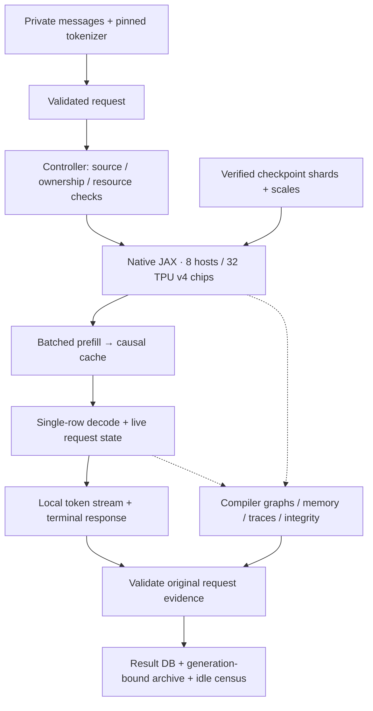

# GLM TPU

### Native-JAX long-context inference on 32 TPU v4 chips

A systems research implementation of **GLM-5.2-FP8**: a complete 78-layer
decoder, topology-aware sharding, batched prefill, and an evidence trail linking
execution to checkpoint bytes, compiler graphs, memory and wall time.

**Measured milestones:** four 128K retrieval runs · a 262,144-token capacity run ·
a protected ordinary user response · 2,832 passing CPU tests on the curated tree.
These are distinct validation results, not a claim of full model-quality parity.

[Architecture](docs/release/ARCHITECTURE.md) ·
[Results](#measured-results) · [Reviewer guide](docs/release/REVIEWER_GUIDE.md) ·
[Installation](docs/release/INSTALLATION.md) · [Inference](docs/release/INFERENCE.md)

> **Scope:** a private, site-specific, single-request research engine—not a
> portable hosted service or a state-of-the-art throughput claim. The supported
> controller cold-loads and compiles on each invocation; the user smoke measured
> approximately 38 minutes for that startup phase.

## The systems problem

Making a large mixture-of-experts model execute is only part of accelerator
portability. Weight placement, sparse selection, cache state, compiler behavior
and physical communication must agree, while leaving memory for long contexts.
A fast device kernel alone does not establish a correct or fast request.

This project implements the native execution path and the machinery to inspect
those boundaries together. It combines DeepSeek Sparse Attention (DSA) operations
used by GLM, IndexShare, routed/shared experts, and explicit distributed ownership.
The attention mechanism's name does **not** mean this runs the DeepSeek model:
the target is GLM-5.2-FP8, and inference does not execute through legacy
`tpu-inference`.

### Engineering focus

- **Topology-aware execution.** WS32_2D uses all 32 chips with explicit feature-four
  and expert-eight groups. Hidden state stays sharded rather than being
  reconstructed across the full pod repeatedly inside each layer.
- **Separate prefill and decode.** Layer-major prefill processes prompt rows in
  B128/B114 shapes; decode has one live row. These are not concurrent request batches.
- **Weight integrity and placement.** Packed payloads, scales, manifests and
  direct local-shard loading connect retained source weights to device layout.
- **Inspectable behavior.** DSA selection/tie checks, cache checks, compiler-graph
  inspection and per-chip memory measurements accompany original tokens and wall
  time. Each check has a specific scope; none proves universal bitwise equivalence.
- **Failure-aware operation.** Exact source pins, ownership checks and serialized
  launches protect execution. Upload/collection recovery preserves originals
  rather than rerunning a response to replace missing evidence.

These are implementation areas, not claims that each technique is novel.
PP8/PP16 exploration and its evidence remain in research history; the supported
release path is WS32_2D.

## Execution and evidence



Conceptual dataflow, not physical wiring or a latency timeline. Device traces and
profiler-free timing have separate scopes. A locally flushed token is not a
network-delivered latency measurement.

## Measured results

Historical protected runs on the same 8-host, 32-chip TPU v4 installation. Each
receipt records its own source/recovery pins and validation boundary. These are
**not** a new benchmark of the documentation release, an optimized scaling study,
or an apples-to-apples comparison against another serving engine.

| Workload | Prefill tokens/s | Decode wall tokens/s | Evidence and scope |
|---|---:|---:|---|
| 2,034-token prompt | 62.761 | 7.660 | [DB610](docs/artifacts/prefill-canonical-short-db610-sealed-20260909.json): scoped short-context numerical checks |
| 127,363-token passkey, depth 0.95 | 45.459 | 6.935 | [DB619](docs/artifacts/prefill-delivery-db619-sealed-20260912.json): retrieval on this protected prompt |
| 262,144-token E0 | 32.157 | 6.148 | [DB620](docs/artifacts/prefill-delivery-db620-sealed-20260912.json): capacity and structural checks; **no correctness oracle** |

Prefill excludes cold loading/compilation and later decode preparation. Decode
rates are steady wall measurements, not aggregate multi-request throughput.
All four 128K passkey depths completed (DB616–619). The 256K run measured
**29.930 GB peak HBM per chip** and **3.084 GB minimum headroom** (decimal GB).

### Ordinary user-response validation

[DB621](docs/release/user-response-db621-sealed-20260914.json) exercised the release
request path: a 19-token prompt, 71 generated tokens, the requested `READY` answer,
EOS termination, original evidence validation and authenticated eight-host cleanup.
Generation includes reasoning tokens; this is a smoke test, not a quality score.

Startup loading/compilation took 2,283.431 seconds. After that separate phase,
local first-token delivery took 9.368 seconds; the 50.241-second request wall was
**instrumented**, not a clean steady-service latency measurement.
[Full qualifications and evidence linkage](docs/release/STATUS.md).

### What is not established

- Full GPQA/AIME accuracy or agreement with the original model card. The stopped
  campaign's incomplete prefix is not a dataset accuracy estimate.
- Blanket bit-exact equivalence across builds, contexts or outputs. The 2K
  numerical result does not prove the current path at 8K.
- General task quality at 256K: E0 had no correctness oracle.
- HTTP serving, concurrent batching, persistent warm serving, durable KV recovery
  or speculative decoding. Pause/resume is within the same live session.
- A sampled 256K user endpoint: the current sampled graph has capacity 166,912
  tokens shared by prompt and generation; the 256K E0 graph is separate.

## Start here

For an offline first look, from this checkout with Python 3.12:

```bash
python -m glm_tpu info
python -m glm_tpu doctor --profile core
```

These commands inspect metadata without initializing TPU devices, downloading
weights or starting inference. `doctor` reports missing/mismatched dependencies;
it does not grant launch authority.

With the documented development environment installed:

```bash
JAX_PLATFORMS=cpu python tools/check_release.py
```

The release check on the curated tree passed with 524 tests passed and 1 skipped, plus
source, content and isolated package checks; the whole retained CPU tree is
recorded in [TESTING](docs/release/TESTING.md): 2,832 passed, 122 skipped with stated reasons and 173 failed, every failure being a historical admission test bound to a sealing-source pin or a sealed-identity assertion that fails identically at the starting pin (none introduced by curation).
[Release-check receipt](docs/release/curation-cpu-check-20260915.json) ·
[Whole-tree receipt](docs/release/curation-whole-tree-cpu-20260915.json) ·
[Fresh-install receipt](docs/release/fresh-install-20260914.json).
CPU tests do not replace hardware evidence.

Actual inference needs retained weights, full Git history, a reviewed source pin
and the existing site configuration. Follow [installation](docs/release/INSTALLATION.md),
[checkpoint recovery](docs/release/CHECKPOINTS.md) and the
[user-request example](docs/release/INFERENCE.md); the wheel alone is not a server.
Do not use a historical campaign script as a generic installer.

## Explore the implementation

| Area | Entry point |
|---|---|
| Layer-major prefill | [ws32_batched_prefill.py](glm_tpu/greenfield/runtime/ws32_batched_prefill.py) |
| Decoder construction | [ws32_decoder.py](glm_tpu/greenfield/runtime/ws32_decoder.py) |
| Live request state, delivery and stop policy | [ws32_request_session.py](glm_tpu/greenfield/runtime/ws32_request_session.py) |
| JAX and Pallas operations | [kernels/](glm_tpu/greenfield/kernels/) |
| Weight layout and direct loading | [checkpoint/](glm_tpu/greenfield/checkpoint/) |
| WS32 mesh, sharding and HLO contracts | [sharding/](glm_tpu/greenfield/sharding/) |
| Protected user controller and recovery | [scripts/release/](scripts/release/) |
| Request/failure-path checks | [tests/release/](tests/release/) |
| Per-file curation ledger and recovery | [docs/curation/](docs/curation/README.md) |
| Performance analysis vs. the Kaggle TPU reference engines, opt-in challengers | [docs/perf/](docs/perf/REFERENCE_LOWHANGING_FRUIT_20260919.md) · [glm_tpu/perf/](glm_tpu/perf/) |

For a focused technical review, use the [reviewer guide](docs/release/REVIEWER_GUIDE.md).
The [observability guide](docs/greenfield/GATE_D_OBSERVABILITY_PLAYBOOK.md)
distills the causal-debugging lessons, evidence limits and current tool locations;
the original campaign instructions remain recoverable in Git.

## Project policy

Maintained by Gianluigi Vitale. `main` is the curated private release: every
tracked file has a recorded role in the [curation ledger](docs/curation/README.md),
and research-only material is recoverable at the starting pin. Research continues
on `rewrite/topology-first-decode` and other preserved branches.
Original results and research history remain intact. Weights, credentials,
private questions and raw runtime databases stay outside Git.

[Development](CONTRIBUTING.md) · [Operations](docs/release/OPERATIONS.md) ·
[Security and audit limits](SECURITY.md) · [Third-party notices](THIRD_PARTY_NOTICES.md).
Public distribution still requires an original-code licensing decision and
historical privacy/provenance review; no public-release clearance is implied.
