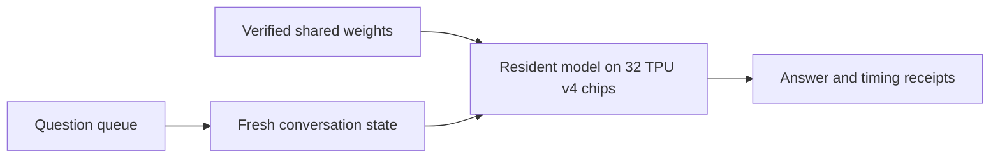

# glm-tpu

GLM-5.3 FP8 inference in native JAX and Pallas on 32 TPU v4 chips.

[Abstract](#abstract) · [Contributions](#contributions) ·
[System design](#system-design) · [Evaluation](#evaluation) ·
[Reproducibility](#reproducibility) · [Layout](#repository-layout) ·
[Documentation](#documentation) · [License](#license) · [Citation](#citation)

## Abstract

GLM-5.3 is a 78-layer mixture-of-experts language model whose official FP8
checkpoint holds 755,632,050,320 bytes. glm-tpu is a purpose-built multi-host
inference engine for this checkpoint, written in native JAX with custom Pallas
kernels, for a Cloud TPU v4-64 slice: 32 TPU v4 chips on 8 hosts. TPU v4 has no
FP8 arithmetic, so the engine keeps the routed-expert weights in FP8 and decodes
them inside its kernels, while an 8 x 4 device mesh shards every layer over the
32 chips. It answers single questions and serves a resident session that keeps
the model loaded, a browser chat UI, an OpenAI-compatible `/v1` API and batches
of four chats. One chat decodes at 13.57 tokens/s, four simultaneous chats at
4.89–5.12 tokens/s each, and on the first 770 GSM8K test questions the engine
answered 740 correctly (96.1%; a partial evaluation).

## Contributions

- **Multi-host FP8 MoE inference without FP8 hardware.** GLM-5.3, including its
  DeepSeek Sparse Attention (DSA), runs on 32 TPU v4 chips. Routed experts stay
  in FP8 with 128x128 block scales; non-routed weights are converted once, at
  load, to resident BF16 ([architecture](docs/release/ARCHITECTURE.md#the-model)).
- **Pallas TPU kernels** for the two dominant operations: a route-grouped FP8
  expert projection whose grid covers only the selected experts, and fused
  sparse attention that copies only aligned tiles around the selected cache
  rows into on-chip memory (`glm_tpu/kernels/`).
- **Resident and batched serving** with independent conversation state: one
  loaded session answered 770 questions in sequence, each from a fresh cache,
  and a batch mode decodes four chats together
  ([ordinary inference](docs/release/OPTIMIZED_INFERENCE.md),
  [four chats](docs/release/CONCURRENT.md)).
- **A graph-equivalence method** for refactoring a hardware-bound system from a
  CPU host. A harness lowers every production TPU program on the CPU and
  compares normalized program digests, CPU numerics, checkpoint identities,
  import structure and wire formats with a recorded baseline. Through the
  restructuring for this release the program, numerics and checkpoint-identity
  records never changed; the others changed only in separate, reviewed
  re-baseline commits. A TPU comparison confirmed identical tokens for 17 of 17
  requests ([harness](tools/equivalence/README.md),
  [comparison](docs/release/STATUS.md#tpu-comparison-of-the-current-tree)).

GLM's architecture, trained weights and tokenizer are reused. JAX, Pallas, XLA
and libtpu provide the compiler and runtime. The contribution is the TPU
implementation and its integration ([notices](THIRD_PARTY_NOTICES.md)).

## System design

The 32 chips form one `expert=8 x feature=4` device mesh. The hidden state
stays sharded over the four `feature` chips; routed experts are spread over the
eight `expert` chips. Every collective runs over one mesh axis, and exchanges
across the full slice are limited to consensus values of at most 4 KiB. Each
compiled program is checked for these rules, and for its memory, before it
runs.

A request passes through four stages:

1. **Preparation** (CPU only). The question is rendered with the pinned chat
   template and tokenized into a hashed request file.
2. **Launch.** A controller on rank 0 (host 0 of the slice) stages the pinned
   commit and the request to all eight hosts and starts one worker per host.
3. **Load and compile.** Each worker verifies its four checkpoint files, loads
   them onto its four chips and compiles the programs.
4. **Generation.** Prefill processes the whole prompt; decode then generates one
   token per step. All eight hosts vote on every phase and every token, and
   rank 0 writes the tokens.

Attention uses DeepSeek Sparse Attention (DSA): a small indexer scores the
cached positions and the model attends only to the top 2,048 of them.



[Architecture and code map](docs/release/ARCHITECTURE.md) ·
[Project summary](docs/release/PROJECT_SUMMARY.md).

## Evaluation

### Setup and method

- **Hardware and software.** 32 TPU v4 chips on 8 hosts; JAX and jaxlib 0.10.1,
  libtpu 0.0.41; model `zai-org/GLM-5.3` at revision
  `aca966e4e02791568aa6a4ced368624b3d897f42`.
- **Decoding.** Greedy, with thinking on at maximum effort, in a 32,768-slot
  context. Each answer could use all remaining slots.
- **Timing.** Every time is that of the slowest host. Output counts include
  thinking; the first output token comes from prefill. The evaluation decode
  rate is total timed decode tokens divided by summed per-question decode time.
  It excludes prompt prefill, queue overhead and startup.
- **Scoring.** Prompts were the original questions plus an instruction to box
  the final answer, with no brevity instruction. References stayed out of the
  model inputs. Only the final answer after the reasoning, at a normal end of
  sequence, is scored, by exact comparison of numbers. An unfinished answer is
  never scored as correct. All-host token agreement is checked separately.

### Results

| Measurement | Result |
|---|---:|
| Single-chat decode, one completed answer | 13.57 tokens/s |
| Decode across the 770-question sequential evaluation | 13.50 tokens/s |
| Solo prompt prefill, 85 tokens | 0.965 s |
| Solo decode, 239 timed tokens | 17.612 s |
| Solo cold start: verification, loading and compilation | 1,219.89 s (20.33 min) |
| Maximum observed HBM per chip, resident evaluation | 28.23 GB |
| Four simultaneous chats, per active chat | 4.89–5.12 tokens/s |

**GSM8K.** Evaluated on the first 770 of the 1,319 GSM8K test questions (rows
0–769, in order): 740 correct (96.1%). The 30 unsuccessful cases include three
that exhausted the context. This is a partial evaluation, not a full test-set
score. The weights and compiled programs were reused across all 770 questions;
each question started from a fresh conversation state
([receipt](docs/release/glm53-resident-results-20260922.json)).

**Solo example.** The single-chat answer is checkable by hand (house profit):
`80,000 × 2.5 − (80,000 + 50,000) = 70,000`.

**Four chats.** A separate test answered four questions correctly at normal end
of sequence. Its aggregate decode rate over the mixed-length batch was
9.27 tokens/s, distinct from each chat's rate
([receipt](docs/release/glm53-four-answers-20260921.json)).

**Equivalence on the TPU.** The released tree and the pre-restructure baseline
produced identical token streams for 10 sequential, 4 concurrent and 3 resident
requests on the same fleet. Decode speed was 0.994–1.024 of the baseline, and
the programs compiled on the TPUs equal the ones the harness lowers on the CPU
(9/9 programs, 1,062/1,062 Pallas kernels).

### Limitations

The GSM8K result covers an ordered prefix of a public benchmark (rows 0–769)
whose length was not fixed in advance; possible familiarity of the model with the
benchmark and the unplanned prefix length limit its interpretation. It is not a full test-set score.
Scoring checks final numbers, not every reasoning step. The prompts were short,
so they do not establish quality with a full 32K input. Resident mode serves
requests one at a time; four-chat batching is a separate invocation. There is
no automatic recovery of the loaded model or its cache after a process failure.
The CPU equivalence proof does not run XLA's TPU compiler, so a compiler or
libtpu change needs a new TPU comparison.
[Timing boundaries and all limitations](docs/release/STATUS.md).

## Reproducibility

### Check without TPU hardware

You need Python 3.12 on Linux. Install into a new virtual environment, never
into a working TPU environment
([installation](docs/release/INSTALLATION.md)):

```bash
uv venv --python 3.12 .venv
uv pip install --python .venv/bin/python '.[runtime,dev]'
```

These commands need no weights, cloud credentials or TPU devices:

```bash
JAX_PLATFORMS=cpu .venv/bin/python -m glm_tpu info
JAX_PLATFORMS=cpu .venv/bin/python -m glm_tpu collect-env --profile runtime
JAX_PLATFORMS=cpu .venv/bin/python -m pytest -q -p no:cacheprovider tests/entrypoints/cli/test_main.py tests/entrypoints/cli/test_ask.py tests/entrypoints/cli/test_prepare.py tests/entrypoints/cli/test_collect_env.py tests/entrypoints/cli/test_checkpoint.py tests/engine/test_request.py tests/engine/test_llm_engine.py tests/executor/test_multihost_executor.py tests/executor/test_fleet.py tests/worker/test_tpu_worker.py tests/utils_/test_io_utils.py tests/config/test_site.py tests/runner/test_tpu_runner.py
```

What you get: in about half a minute, checks of the command line, request
integrity and capacity refusals, the controller's identity, SSH and failure
handling, the checkpoint commands, and delivery and deadlines with synthetic
results. The full suite and the equivalence checks are described in
[TESTING](docs/release/TESTING.md). Tests establish software contracts; speed
and answer quality come only from real weights on a TPU.

### What a hardware run needs

- A Cloud TPU v4-64 slice: **8 hosts with 4 TPU v4 chips each**. The name
  counts TensorCores, two per chip. The site file's check refuses any other
  shape, such as a `v4-32` (16 chips on 4 hosts).
- The pinned Python 3.12 environment (JAX and jaxlib 0.10.1, libtpu 0.0.41) at
  the same path on every host.
- About 756 GB for the downloaded weights, and about 107 GB of free tmpfs
  (RAM-backed storage) per host for the packed checkpoint.
- A clean checkout, pushed to its origin, on a branch the launch policy allows
  (by default `main` or `release/*`), for the commands that start work on all
  hosts (steps 7, 8 and 10 below).

The quickstart uses these terms:

| Term | Meaning |
|---|---|
| rank 0 | Host 0 of the slice. The controller runs there, and every command below runs there unless a step says otherwise. |
| site file | An untracked TOML file with every deployment value: hosts, paths and the digests of the verified assets ([template](examples/site.example.toml)). |
| slot | One of the 32 device positions of the mesh. Each host holds four. |
| packed checkpoint | The weights re-laid-out as 32 slot files, one per slot, in a tmpfs directory on each host: the checkpoint root. |
| seal | `manifest.json` and a self-hashed `SUCCESS` file. They are written only after every file and tensor checksum passes; the runtime loads only a sealed checkpoint. |
| topology binding | A recorded map of which host, JAX process and chip holds each mesh position. Every worker checks it before it opens a device. |
| resident session | A run that keeps the weights and compiled programs loaded and answers later requests from its inbox directory. |

### Quickstart: from the weights to an answer

Each step is one command of this repository; the linked page has the details.
In the commands, `python` is the environment from step 1.

1. **Install the environment.** On rank 0, from the checkout:

   ```bash
   uv venv --python 3.12 .venv
   uv pip install --python .venv/bin/python '.[runtime,tpu,dev]'
   ```

   Create the same environment at the same absolute path on the other seven
   hosts, from a copy of the checkout or from the
   [wheel](docs/release/INSTALLATION.md#the-wheel). The site file names this path
   as `fleet.worker_python`. Only rank 0 needs the checkout: the controller
   copies the source it runs to every host.

   What you get: the same pinned environment on all eight hosts.

2. **Download the weights.** Put them on every host, or on a mount every host
   sees, in the directory the site file will name as `paths.model_path`. The
   `hf` command comes with the pinned `huggingface-hub`:

   ```bash
   hf download zai-org/GLM-5.3 --revision aca966e4e02791568aa6a4ced368624b3d897f42 --local-dir /path/to/GLM-5.3-FP8
   ```

   What you get: 141 safetensors shards (755,632,050,320 bytes), the tokenizer
   and the configuration files.

3. **Mark the verified source.** This hashes every file and compares it with the
   Hugging Face repository
   ([details](docs/release/CHECKPOINTS.md#mark-the-source)):

   ```bash
   JAX_PLATFORMS=cpu python -m glm_tpu checkpoint mark-source /path/to/GLM-5.3-FP8
   ```

   What you get: a marker file, `SOURCE_COMPLETE.json`, in the source directory,
   and a report. The report's `marker_sha256` goes into the site file as
   `checkpoint.source_complete_sha256`. Copy the same marker file into
   `paths.model_path` on every host.

   > Note: to check another host's copy of the weights, run the command there
   > with `--upstream-marker` naming this marker and `--output` a scratch file.
   > The site still pins the copied marker.

4. **Inventory the source.**

   ```bash
   JAX_PLATFORMS=cpu python -m glm_tpu checkpoint inventory /path/to/GLM-5.3-FP8 \
     --output /path/to/checkpoints/<inventory-tag>/source_inventory.json --model-id zai-org/GLM-5.3 \
     --revision aca966e4e02791568aa6a4ced368624b3d897f42
   ```

   What you get: `source_inventory.json`. Its `inventory_sha256` goes into the
   site file as `checkpoint.source_inventory_sha256`. The file must lie inside
   `checkpoint.inventory_namespace`, at the same path on every host.

5. **Write the site file.** Copy the template and make it readable only by you
   (mode 600):

   ```bash
   mkdir -p ~/.config/glm-tpu
   cp examples/site.example.toml ~/.config/glm-tpu/site.toml
   chmod 600 ~/.config/glm-tpu/site.toml
   ```

   Then fill in every `<...>` value
   ([the site file](docs/release/INSTALLATION.md#the-site-file)). Steps 7 and 8
   print some values: the `[topology]` table and the manifest and `SUCCESS`
   digests. Write 64 zeros for each until then. Set `topology.slice_name` (the
   TPU name) and `checkpoint.root` now, because steps 7 and 8 record them.

   What you get: a site file that the commands below find by default.

   > Note: `checkpoint.root` must be a new directory directly inside
   > `checkpoint.namespace`, named
   > `greenfield_ws32_runtime_pack_<YYYYMMDD>T<HHMMSS><9 digits>Z`; the pack run
   > in step 8 takes this name.

6. **Check the environment** on every host
   ([details](docs/release/INSTALLATION.md#check-an-environment)):

   ```bash
   JAX_PLATFORMS=cpu python -m glm_tpu info
   JAX_PLATFORMS=cpu python -m glm_tpu collect-env --profile tpu
   ```

   What you get: a report that every installed package matches its pin.

7. **Capture the topology and bind it**, with no other job on the hosts
   ([details](docs/release/OPERATIONS.md#the-topology-binding)). The capture is
   a model-free job of about a minute on the TPUs; the binding is derived from
   its run:

   ```bash
   JAX_PLATFORMS=cpu python -m glm_tpu topology capture --site ~/.config/glm-tpu/site.toml
   JAX_PLATFORMS=cpu python -m glm_tpu topology bind /path/to/runs/<capture run> --output /path/to/binding
   ```

   What you get: a binding directory and its digests. Copy the printed
   `binding_dir`, `binding_sha256`, `capture_root`, `topology_sha256`,
   `topology_fleet_sha256`, `mesh_sha256` and `slice_name` into the site file's
   `[topology]` table.

8. **Pack and seal the checkpoint** on the eight hosts
   ([details](docs/release/CHECKPOINTS.md#packing)). Packing runs on the CPUs
   and takes hours. First enable lingering, or set `RemoveIPC=no`, on every
   host, so that tmpfs files survive the end of a login session.
   `--preflight-only` runs every host's checks without packing:

   ```bash
   JAX_PLATFORMS=cpu python -m glm_tpu checkpoint pack --site ~/.config/glm-tpu/site.toml --preflight-only
   JAX_PLATFORMS=cpu python -m glm_tpu checkpoint pack --site ~/.config/glm-tpu/site.toml
   ```

   What you get: the sealed packed checkpoint, four slot files per host. Copy the
   printed `manifest_sha256` and `success_sha256` into the site file's
   `[checkpoint]` table.

9. **Verify the packed checkpoint** on every host. Put the site file on every
   host at the same path first. The pack report's `installed` rows and the
   binding's `host_to_slots` name each host's four slots. Then, on rank 0 with no
   other job running, run the worker preflight test against the real site file
   ([checkpoint](docs/release/CHECKPOINTS.md#inventory-and-verify-on-local-files),
   [testing](docs/release/TESTING.md)):

   ```bash
   JAX_PLATFORMS=cpu python -m glm_tpu checkpoint verify --site ~/.config/glm-tpu/site.toml --slots <four slots> --local-slot-layout
   GLM_TPU_TEST_SITE=~/.config/glm-tpu/site.toml JAX_PLATFORMS=cpu python -m pytest -p no:cacheprovider tests/worker/test_local_preflight.py -m site
   ```

   What you get: every slot file checked against the seal, and a passing
   preflight on real assets.

10. **Start a resident session and ask** (next section).

    What you get: `RUN <run directory>`, then the answer
    (`RESIDENT_RESULT ...`). The model stays loaded for later questions.

11. **Open the chat UI or the `/v1` API** on that session, once it has answered
    ([below](#the-chat-ui-and-the-v1-api)).

### A resident session

Start a session from rank 0 when no other job runs on the hosts:

```bash
JAX_PLATFORMS=cpu python -m glm_tpu ask "Your question" --keep-loaded --wall-seconds 14400
```

The command prints its run directory, answers, and keeps the model loaded.
Loading and compiling take about 20 minutes, once per session.

The default context is **32,768 slots**, shared by input, history, thinking and
output. `--context` selects another size: `8k` (8,192 slots), `128k` (128K
prompt / 163K total: 166,912 slots) or `256k` (262,144 slots). The cache is
reserved and the programs are compiled for that size at startup; shorter
questions need not fill it. Without an output cap, the answer may use every
remaining slot. Thinking is on at maximum effort.

Later questions go to the session's inbox; they do not start another model.
Each request starts from a fresh state, so send the full history to continue a
conversation ([submission, stopping and four-chat
usage](docs/release/OPTIMIZED_INFERENCE.md)).

### The chat UI and the `/v1` API

The [chat UI](docs/UI.md) is a browser workspace on a running resident session:
saved conversations, streamed answers, visible thinking, light and dark themes
and a mobile layout. The same server exposes a stateless
[OpenAI-compatible `/v1` API](docs/API.md) with tool calling and streaming, for
local development tools. Closing the UI does not unload the model.

Start the server on rank 0 after the session has answered its first request
(the controller printed `RESIDENT_RESULT`). Pass the run directory that the
session printed as `RUN <directory>`
([how the server finds the session](docs/UI.md#open-the-workspace)):

```bash
JAX_PLATFORMS=cpu python -m glm_tpu.entrypoints.serve.server \
  --run /absolute/path/to/resident-run \
  --state /absolute/path/outside-the-repository/private-chats \
  --port 8011
```

The server listens on loopback only. Forward port 8011 to your machine, then
open http://127.0.0.1:8011, or call the API with the key the server created at
`<state>/api-key` on rank 0:

```bash
export GLM_API_KEY="$(ssh <rank-0 host> cat /absolute/path/outside-the-repository/private-chats/api-key)"
curl -s http://127.0.0.1:8011/v1/chat/completions \
  -H "Authorization: Bearer $GLM_API_KEY" -H "Content-Type: application/json" \
  -d '{"model": "glm-5.3", "messages": [{"role": "user", "content": "Your question"}]}'
```

### Scope

This is a single-site engine with a file-based request queue, a local chat UI and a
key-authenticated loopback API. It is not a hardened multi-tenant service
([security](SECURITY.md)).

## Repository layout

| Path | Contents |
|---|---|
| `glm_tpu/` | The engine package (`python -m glm_tpu`, console command `glm-tpu`). |
| `glm_tpu/entrypoints/` | The command line, the loopback chat UI, the OpenAI-compatible `/v1` API and their server. |
| `glm_tpu/executor/`, `glm_tpu/worker/` | The rank-0 controller that stages and launches a run on the hosts, and the per-host worker. |
| `glm_tpu/engine/`, `glm_tpu/runner/` | Requests, the per-request host loop and the resident protocol; program building, compilation and admission. |
| `glm_tpu/models/`, `glm_tpu/layers/`, `glm_tpu/kernels/` | GLM-5.3 (`glm_moe_dsa`), its per-shard layer bodies and the Pallas TPU kernels. |
| `glm_tpu/model_loader/`, `glm_tpu/distributed/`, `glm_tpu/config/` | The checkpoint pipeline, the multi-host runtime and mesh, the model and site configuration. |
| `tests/` | CPU tests, laid out like `glm_tpu/`; `tests/golden/` holds the equivalence records, `tests/reference/` an unsharded reference model. |
| `tools/equivalence/` | The graph-equivalence harness ([README](tools/equivalence/README.md)). |
| `examples/site.example.toml` | The template of the untracked site file. |
| `docs/` | The documentation listed below. |

A map of every module is in [ARCHITECTURE](docs/release/ARCHITECTURE.md), and
of every file in [AGENTS](AGENTS.md#repository-map).

## Documentation

| Page | For |
|---|---|
| [Project summary](docs/release/PROJECT_SUMMARY.md) | the problem, approach, results and limits on one page |
| [Installation](docs/release/INSTALLATION.md) | environments, extras, `collect-env`, the wheel, the site file |
| [Ordinary inference](docs/release/OPTIMIZED_INFERENCE.md) · [Four conversations](docs/release/CONCURRENT.md) | `ask`, resident sessions, the inbox, stopping, batching |
| [Chat UI](docs/UI.md) · [Local API](docs/API.md) | the browser workspace and the `/v1` API |
| [Checkpoint](docs/release/CHECKPOINTS.md) | the pinned model, the packed checkpoint, `checkpoint inventory` and `checkpoint verify` |
| [Operations](docs/release/OPERATIONS.md) | the controller, launch policy, locks, failure handling and diagnosis |
| [Architecture](docs/release/ARCHITECTURE.md) | the module map, the request path, parallelism and numerical conventions |
| [Testing](docs/release/TESTING.md) · [Equivalence harness](tools/equivalence/README.md) | the test layout, tiers and equivalence checks |
| [Reviewer guide](docs/release/REVIEWER_GUIDE.md) | a reading order and the source package |
| [Release status](docs/release/STATUS.md) · [Migration history](docs/release/GLM53_MIGRATION.md) | the measured GLM-5.3 release, the TPU comparison of this tree, and how the release was reached |
| [Handoff](docs/development/HANDOFF.md) · [Goal](docs/development/goal.md) · [Agent instructions](AGENTS.md) | the development state, the release goal and the working rules |
| [Contributing](CONTRIBUTING.md) · [Security](SECURITY.md) | the development policy, the release checks and vulnerability reporting |

Earlier versions are tagged. This release is `v1.0.0`; the GLM-5.3 release
before the restructure is `pre-refactor-main-20260922`. The GLM-5.2
implementation and measurements are at `glm-5.2`; its weight payloads were
retired. The research tree this release was cut from (research history, the
curation ledger, the legacy sampled and long-context interfaces, benchmarks and
their evidence) is at `archive/research-20260922`; for example
`git show archive/research-20260922:docs/perf/README.md`.

## License

Copyright 2026 Gianluigi Vitale. The project's own work is licensed under the
[Apache License 2.0](LICENSE). Third-party material keeps its own license: the
GLM-5.3 configuration files under `glm_tpu/models/glm_moe_dsa/hf_config/` are
under Z.AI's GLM-5.3 license ([notices](THIRD_PARTY_NOTICES.md)).

Maintained by Gianluigi Vitale. Built with AI coding agents under the author's
direction; changes are verified by the automated equivalence checks and test
suite, not by independent human review. Report security problems privately, as
[SECURITY](SECURITY.md#reporting-a-vulnerability) describes.

## Citation

If you use this software, please cite it
([CITATION.cff](CITATION.cff)):

```bibtex
@software{vitale_glm_tpu_2026,
  author  = {Vitale, Gianluigi},
  title   = {glm-tpu: {GLM-5.3} {FP8} inference on a 32-chip {TPU} v4 pod},
  year    = {2026},
  month   = sep,
  version = {1.0.0},
  license = {Apache-2.0},
  url     = {https://github.com/GianluigiVitale/glm-tpu}
}
```
