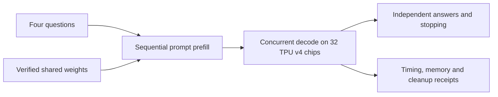

# GLM TPU

### GLM-5.3 FP8 inference in native JAX on 32 TPU v4 chips

A systems engineering project that takes a trained mixture-of-experts model
from checkpoint shards to completed answers: distributed weight placement,
sparse attention, expert routing, cache ownership and concurrent decoding.

**One shared model · Four concurrent conversations · 32K slots per conversation**

[Results](#measured-results) · [Run inference](#run-inference) ·
[Project summary](docs/release/PROJECT_SUMMARY.md) ·
[Architecture](docs/release/ARCHITECTURE.md) ·
[Reviewer guide](docs/release/REVIEWER_GUIDE.md)

## Engineering contribution

The project integrates a complete inference path on an eight-host TPU v4 site.
Its central problem is making checkpoint placement, communication, compiler
memory use and independent conversation state agree across all 32 chips.

| Area | Implementation |
|---|---|
| Distributed execution | Feature-four and expert-eight groups preserve sharded hidden state. |
| Model computation | Grouped routed experts, resident BF16 non-routed weights, sparse-attention selection and native JAX/Pallas execution. |
| Concurrent conversations | Shared weights with four separate caches, output streams and stopping decisions. Prompts are prefilled sequentially. |
| Checkpoint integrity | Verified FP8 source, device-owner packing and checked payload/scale/manifests. |
| Operation | Published-source launches, fresh graph/memory checks, token delivery and authenticated eight-host cleanup. |

GLM's architecture, trained weights and tokenizer are reused. JAX, Pallas, XLA
and libtpu provide compiler/runtime facilities. The contribution is the TPU
implementation and integration, not a new foundation model or compiler.
[Code map](docs/release/ARCHITECTURE.md) · [Attribution](THIRD_PARTY_NOTICES.md).



## Measured results

The same four fixed GSM8K questions ran concurrently with real GLM-5.3 weights.
**All four produced correct completed final answers and normal EOS.**
Fresh graph/memory checks, all-host token agreement and eight-host cleanup passed.
[Measured receipt](docs/release/glm53-four-answers-20260921.json).

| Measurement | Result |
|---|---:|
| Decode per active conversation | **4.89–5.12 tokens/s** |
| Aggregate decode across the mixed-length batch | **9.27 tokens/s** |
| Sequential prefill, 317 input tokens | **3.885 s · 81.60 tokens/s** |
| Decode, 563 timed tokens after four prefill-produced tokens | **60.737 s** |
| Batch duration after startup/warmup, including text decoding | **66.30 s** |
| Cold loading, verification and compilation | **1,178.09 s · 19.63 min** |
| Worker duration including initialization, startup and warmup | **1,269.09 s · 21.15 min** |
| Maximum observed HBM per chip | **28.79 GB** |

Timings use the slowest host; per-conversation rates use the lowest host rate.
Compiler calls account for 692.65 s within cold startup. Decode includes fleet
votes and local token writes. Aggregate throughput is not each chat's speed.
Worker duration excludes controller staging/SSH and post-worker cleanup.

| Fixed GSM8K test row | Final answer | Output tokens, including reasoning | Stop |
|---|---:|---:|---|
| 0 | 18 | 112 | EOS |
| 1 | 3 | 57 | EOS |
| 2 | 70,000 | 298 | EOS |
| 3 | 540 | 100 | EOS |

A checkable example is row0: `(16 − 3 − 4) × 2 = 18`. Reference answers were
kept out of model inputs. The fixed inputs retained their existing concise-
explanation/boxed-answer instruction; maximum thinking and the full remaining
context allowance were enabled. No new brevity workaround or output cap was added.

These are four familiar short examples, **not broad accuracy or full-32K-input
proof**. The model recognized one benchmark example. Token agreement is separate
from answer correctness. [Timing boundaries and limits](docs/release/STATUS.md).

## Run inference

Hardware inference requires the existing `db-v4-64-od` site in `us-central2-b`:
**eight hosts, 32 TPU v4 chips**, verified local owner shards, the approved GCS
mount and topology assets, a full published Git checkout, and the pinned Linux
Python3.12 environment with JAX/jaxlib0.10.1 and libtpu0.0.41.
[Installation](docs/release/INSTALLATION.md) · [Weights and capacity](docs/release/CHECKPOINTS.md).

From a clean, published checkout on authenticated rank0, use the site interpreter.
Save a JSON array of one to four question strings outside Git, then run:

```bash
JAX_PLATFORMS=cpu python -m glm_tpu ask --questions /private/questions.json \
  --context 32k --concurrent --wall-seconds 14400
```

Each conversation gets **32,768 combined input/history/reasoning/output slots**.
Omitting an output cap gives it every remaining slot after tokenizing the full
input. Thinking is enabled at maximum effort; generation stops independently at
normal EOS or context exhaustion. A timeout or unfinished answer is incomplete.

The command reports a private run directory with each conversation's token stream,
answer and receipts, and prints responses after cleanup. Preparation uses CPU;
protected workers explicitly select TPU execution. Each invocation pays cold
startup. This is a fixed-batch research engine, with no persistent HTTP service,
online request admission or durable KV recovery. [Detailed usage](docs/release/OPTIMIZED_INFERENCE.md).

## Review without TPU hardware

With the documented CPU environment installed, these commands need no weights,
cloud credentials or TPU devices:

```bash
JAX_PLATFORMS=cpu python -m glm_tpu info
JAX_PLATFORMS=cpu python -m glm_tpu doctor --profile core
JAX_PLATFORMS=cpu python -m pytest -q \
  tests/release/test_cli.py tests/release/test_optimized_request.py \
  tests/release/test_optimized_ask.py tests/release/test_batched_session.py
```

The full release CPU gate passed627tests with one skip before the final affected
checks. These checks establish software contracts; actual answer evidence comes
from the TPU run. [Testing](docs/release/TESTING.md) ·
[Commit-bound source archive](docs/release/SHAREABLE_PACKAGE.md).

## History and ownership

[GLM-5.2 release](https://github.com/GianluigiVitale/glm-tpu/releases/tag/glm-5.2)
preserves its implementation and measurements; its weight payloads were retired.
[GLM-5.3 migration history](docs/release/GLM53_MIGRATION.md) records acquisition
failures, recovery and compatibility fixes. [Research history](docs/perf/README.md)
and the [curation ledger](docs/curation/README.md) preserve original evidence,
research branches, licenses and DB616–621. Legacy sampling/long-context evidence
is [documented separately](docs/release/INFERENCE.md).

Maintained by **Gianluigi Vitale**. The repository and reviewer archive remain
private. Original code has no blanket open-source license; upstream attribution
and licenses are retained. Review is assistant self-review, not independent review.
