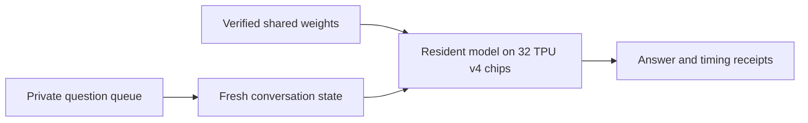

# GLM TPU

### GLM-5.3 FP8 inference in native JAX on 32 TPU v4 chips

A systems engineering project that takes a trained mixture-of-experts model
from checkpoint shards to completed answers: distributed weight placement,
sparse attention, expert routing, cache ownership and concurrent decoding.

**13.57 tokens/s for one chat · Keep the model loaded · Four-chat batching**

[Results](#measured-results) · [Run inference](#run-inference) ·
[Chat UI](docs/UI.md) · [Local API](docs/API.md) ·
[Project summary](docs/release/PROJECT_SUMMARY.md) ·
[Architecture](docs/release/ARCHITECTURE.md) ·
[Reviewer guide](docs/release/REVIEWER_GUIDE.md)

## Engineering contribution

The central problem is making checkpoint placement, communication, compiler
memory use and independent conversation state agree across eight hosts and
32 TPU v4 chips.

| Area | Implementation |
|---|---|
| Distributed execution | Feature-four and expert-eight groups preserve sharded hidden state. |
| Model computation | Grouped routed experts, resident BF16 non-routed weights, sparse attention and native JAX/Pallas execution. |
| Conversation state | Shared weights with independent caches and stopping; four-chat batching uses sequential prompt prefill. |
| Resident operation | Private sequential requests reuse loaded weights and compiled graphs, with fresh state for each request. |
| Reproducibility | Verified checkpoint packing, source-bound launches, graph/memory admission and per-host token receipts. |

GLM's architecture, trained weights and tokenizer are reused. JAX, Pallas, XLA
and libtpu provide compiler/runtime facilities. The contribution is the TPU
implementation and integration. [Code map](docs/release/ARCHITECTURE.md) ·
[Attribution](THIRD_PARTY_NOTICES.md).



## Measured results

**740 of 770 GSM8K questions scored correct: 96.1% on the evaluated subset.**
The owner stopped after test rows 0–769; 549 of the 1,319 test questions were not
run. The 30 unsuccessful cases include three that exhausted context. This is an
ordered partial evaluation, not a full-test-set accuracy claim.
[Result receipt](docs/release/glm53-resident-results-20260922.json).

| Measurement | Result |
|---|---:|
| Single-chat decode, one completed answer | **13.57 tokens/s** |
| Decode across the 770-question sequential evaluation | **13.50 tokens/s** |
| Solo prompt prefill, 85 tokens | **0.965 s** |
| Solo decode, 239 timed tokens | **17.612 s** |
| Solo cold verification, loading and compilation | **1,219.89 s · 20.33 min** |
| Maximum observed HBM per chip, resident evaluation | **28.23 GB** |
| Four simultaneous chats, per active chat | **4.89–5.12 tokens/s** |

Output counts include thinking. Timings use the slowest host; the evaluation
rate is total timed decode tokens divided by summed per-question decode time.
It excludes prompt prefill, queue overhead and startup. The first output token
comes from prefill. Weights and compiled graphs were reused across 770 questions;
every question started with independent conversation state.

The evaluation used greedy decoding, maximum thinking, full remaining 32K
allowances and a boxed-answer format instruction without a brevity instruction.
References stayed out of model inputs. Scoring compares final-channel numbers
exactly; unfinished reasoning never counts as a correct answer. All-host token
agreement is checked separately. A checkable solo example is house profit:
`80,000 × 2.5 − (80,000 + 50,000) = 70,000`.

The separate [four-chat test](docs/release/glm53-four-answers-20260921.json)
completed four correct answers at normal EOS. Its mixed-length aggregate decode
was 9.27 tokens/s, distinct from each chat's speed.
[Timing boundaries and limitations](docs/release/STATUS.md).

## Run inference

Hardware inference requires the retained `db-v4-64-od` site in `us-central2-b`:
**eight hosts, 32 TPU v4 chips**, verified local owner shards, external topology
assets, a full published checkout and the pinned Linux Python 3.12 environment.
The measured runtime uses JAX/jaxlib 0.10.1 and libtpu 0.0.41.
[Installation](docs/release/INSTALLATION.md) · [Weights](docs/release/CHECKPOINTS.md).

To start a session when the fleet is available, from authenticated rank0:

```bash
JAX_PLATFORMS=cpu python -m glm_tpu ask "Your question" --keep-loaded --wall-seconds 14400
```

The default is **32,768 combined input/history/thinking/output slots**. The
runtime reserves cache capacity and compiles fixed shapes at startup; shorter
questions do not have to fill that capacity. Omitting an output cap gives the
answer every remaining slot. Thinking is enabled at maximum effort.

The command prints a private run directory and leaves the model loaded after
answering. Later prepared requests go to that session's inbox; they do not start
another model. Full history must be supplied to continue a conversation.
[Submission, stopping and four-chat usage](docs/release/OPTIMIZED_INFERENCE.md).

For a browser workspace, the [chat UI](docs/UI.md) attaches to an existing
resident session: saved conversations, streamed answers, thinking, light/dark
themes and mobile layout. Forward its loopback port 8011 to open it locally.
The model stays loaded when the UI closes. The same server also exposes a
stateless [OpenAI-compatible `/v1` API](docs/API.md) with tool calling and
streaming, for local development tools.

This is a retained-site engine with a private file queue, a local chat UI and a
key-authenticated loopback API.
There is no automatic recovery of live model or KV state after process failure.
Resident mode serves sequential requests; four-chat batching is a separate
invocation. Short prompts do not establish full-32K-input quality. Public
benchmark familiarity and the owner-selected stopping point limit interpretation
of the partial score.

## Review without TPU hardware

With the documented CPU environment installed, no weights, cloud credentials or
TPU devices are needed for:

```bash
JAX_PLATFORMS=cpu python -m glm_tpu info
JAX_PLATFORMS=cpu python -m glm_tpu doctor --profile core
JAX_PLATFORMS=cpu python -m pytest -q tests/entrypoints/cli/test_main.py tests/engine/test_request.py tests/entrypoints/cli/test_ask.py tests/executor/test_multihost_executor.py tests/executor/test_fleet.py tests/worker/test_tpu_worker.py tests/utils_/test_io_utils.py tests/config/test_site.py tests/runner/test_tpu_runner.py
```

The preceding main release passed 629 CPU tests with one skip; the resident
change passed 65 affected tests. Final checks are bound to the release commit
in its publication receipt. Tests establish software contracts, while model
speed and answer evidence come from real weights on TPU.
[Testing](docs/release/TESTING.md) · Source archive (archived at tag `archive/research-20260922`: `docs/release/SHAREABLE_PACKAGE.md`).

## History and ownership

[GLM-5.2](https://github.com/GianluigiVitale/glm-tpu/releases/tag/glm-5.2)
preserves its implementation and measurements; its weight payloads were retired.
[Migration history](docs/release/GLM53_MIGRATION.md),
research history (archived at tag `archive/research-20260922`: `docs/perf/README.md`) and the curation ledger (archived at tag `archive/research-20260922`: `docs/curation/README.md`)
preserve failures, recovery, original evidence, research branches and DB616–621.
Legacy sampling/long-context evidence is documented separately (archived at tag `archive/research-20260922`: `docs/release/INFERENCE.md`).

Maintained by **Gianluigi Vitale**. The repository and reviewer archive remain
private. Original code has no blanket open-source license; upstream attribution
and licenses are retained. Review is assistant self-review, not independent review.
