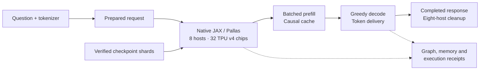

# GLM TPU

> **GLM-5.3 migration branch.** The completed GLM-5.2 version is preserved in
> [release glm-5.2](https://github.com/GianluigiVitale/glm-tpu/releases/tag/glm-5.2).
> Its stored weights have been retired at the owner's request. See
> [migration status](docs/release/GLM53_MIGRATION.md); the results below describe
> GLM-5.2 and do not establish GLM-5.3 readiness.
> GLM-5.3 preparation now uses its pinned template and all remaining context
> slots for output. Use the [migration command](docs/release/GLM53_MIGRATION.md#next-execution-boundary);
> the capped commands below reproduce the historical GLM-5.2 interface only.

### Native JAX inference for GLM-5.2-FP8 on 32 TPU v4 chips

A systems engineering project that takes a trained mixture-of-experts model
from checkpoint shards to distributed inference: weight placement, sparse
attention, expert routing, prefill, decoding, and a usable question interface.

**32 TPU v4 chips · 8 hosts · Single-request and four-conversation inference**

[Architecture](docs/release/ARCHITECTURE.md) ·
[Results](#release-results) ·
[Run a question](#run-a-question) ·
[Reviewer guide](docs/release/REVIEWER_GUIDE.md) ·
[Project summary](docs/release/PROJECT_SUMMARY.md)

## The systems problem

Running a large model on a different accelerator requires more than translating
its operators. Checkpoint layout must agree with device ownership; expert routing
and sparse attention must fit the communication topology; prefill and decoding
must share a consistent cache. Compiler decisions and memory use then determine
whether the complete request can run.

This project brings those pieces together in native JAX and Pallas on an
eight-host TPU v4 installation. The ordinary engine is included on `main`,
alongside the tests, measurements and recovery information needed to inspect it.

## Engineering contribution

| Area | Implementation |
|---|---|
| **Distributed execution** | Explicit feature-four and expert-eight groups keep hidden state sharded across the 32-chip topology. |
| **Attention and expert computation** | Grouped routed experts, resident BF16 non-routed weights, sparse-attention selection and a packed decode loop. |
| **Prefill and request state** | Batched prompt processing, causal cache updates, fresh state per question, and separate prefill/decode execution. |
| **Concurrent conversations** | One shared model advances up to four independent conversation caches in each decode step, with separate token streams and stopping. |
| **Checkpoint integrity** | Payloads, scales and manifests connect retained source weights to their device placement. |
| **Reliable operation** | Source-bound launches, graph and memory checks, local token delivery, failure handling and authenticated cleanup on all eight hosts. |

The contribution is the TPU implementation and integration of these mechanisms.
GLM's architecture, trained weights and tokenizer are reused, as are the
JAX/Pallas/XLA compiler and runtime facilities. [Architecture and code map](docs/release/ARCHITECTURE.md) ·
[Attribution](THIRD_PARTY_NOTICES.md).

## Execution



The controller loads and compiles once per invocation. A queue can contain up to
ten questions, generated one at a time with fresh state for each. With
`--concurrent`, up to four conversations share the model and decode together;
their prompts are prefilled sequentially. Each conversation has its own cache.

## Release results

Measured with real weights on the existing **eight-host, 32-chip TPU v4**
installation. The recommended profile uses **8,192 combined prompt/output slots**.

| Phase | Measured result |
|---|---:|
| **Decode** | **14.55 tokens/s** |
| **Prefill** — 92 input tokens | **0.94 s · 98.10 tokens/s** |
| **Cold loading and compilation** | **1,102.03 s · 18.4 min** |
| Prefill + decode, excluding startup and warmup | 19.09 s |
| Maximum observed HBM per chip | 28.23 GB |

Decode includes fleet votes and local token writes; it counts 264 timed tokens
after the prefill-produced first token. Measurements use the slowest host.
Prefill throughput depends on prompt length. These are execution measurements,
not network latency or aggregate serving throughput.

The released path completed one GSM8K example correctly, ending normally after
265 output tokens including reasoning. Fresh graph/memory checks, all-rank
agreement and eight-host cleanup passed.
[Answer and hardware receipt](docs/release/single-answer-20260920.json).

The **four-conversation mode** allocates **32,768 combined slots per conversation**.
With four short GSM8K questions, active conversations decoded at **4.91–5.19
tokens/s each**. Cold load/compile took **1,094.57 s**; sequential prefill for
317 total input tokens took **3.88 s**. Peak observed HBM was **28.79 GB per chip**.
Three answers finished correctly; one reached its 1,024-token output limit
without a final answer. All-rank agreement, graph/memory checks and eight-host
cleanup passed. This tests allocated capacity, not full 32K input quality.
[Four-conversation receipt](docs/release/four-conversations-20260921.json).

<details>
<summary><strong>Completed-answer example and validation scope</strong></summary>

The example is GSM8K test row 0 at revision
`740312add88f781978c0658806c59bc2815b9866`, selected before generation.
The expected and returned answer were both **18**; the arithmetic is
`(16 − 3 − 4) × 2 = 18`. The reference answer was kept out of the model input.

A preceding integration matched all 29 reference-prefix tokens on all eight
hosts. Numerical agreement and answer correctness are separate checks.
The original CPU release check passed 571 tests with one skip; subsequent
changes passed the affected checks recorded in the
[release check index](docs/release/ordinary-release-checks-20260920.json).
These overlapping test sets are not added into one total.

[Full release status](docs/release/STATUS.md) ·
[Historical tests and their limits](docs/release/TESTING.md).

</details>

**Scope:** one correct example establishes a working request path, not a dataset
accuracy score. Difficult questions have produced prolonged, unfinished reasoning.
The larger profile compiled, but a full 131,072-token input and ten completed
answers were not demonstrated. Earlier long-context results remain
[separate historical evidence](docs/perf/README.md).

## Run a question

Inference uses the existing `db-v4-64-od` installation in `us-central2-b`.
It requires all eight hosts, retained checkpoint shards and topology assets,
the pinned tokenizer, a full Git checkout and the documented Python 3.12
environment with JAX/jaxlib 0.10.1 and libtpu 0.0.41.

[Installation](docs/release/INSTALLATION.md) ·
[Checkpoint requirements](docs/release/CHECKPOINTS.md).

From a clean, published checkout on authenticated rank0, using the site interpreter:

```bash
JAX_PLATFORMS=cpu python -m glm_tpu ask \
  "Explain why the sky is blue in one sentence." \
  --context 8k --max-new-tokens 2048
```

The command loads the model, generates an answer and prints it after cleanup.
It also reports a private run directory containing the token stream, answer and
execution receipts. Preparation runs on CPU; the protected workers select TPU
execution explicitly.

Reasoning uses the same 2,048-token output allowance as the final answer, and the
prompt plus allowance must fit in 8,192 slots. A capped response may be incomplete.
Keep the explicit `--context 8k` option: omitting it selects the larger profile.

To decode up to four conversations together, save a JSON array of question
strings outside Git and run:

```bash
JAX_PLATFORMS=cpu python -m glm_tpu ask --questions /private/questions.json \
  --context 32k --concurrent --max-new-tokens 1024
```

The 32K budget includes input, chat history, reasoning and output. The command
accepts a fixed group; it cannot admit new conversations while that group runs.
The output cap reproduces the tested setup and may stop before a final answer.
See [concurrent inference](docs/release/CONCURRENT.md) for measurements and limits.

Each invocation pays the cold startup cost above. This is a site-specific
research engine with no persistent HTTP service or durable KV recovery.
[Full inference instructions and queues](docs/release/OPTIMIZED_INFERENCE.md) ·
[Separate legacy sampled path](docs/release/INFERENCE.md).

## Review without TPU hardware

With an already installed CPU environment, the following needs no weights,
cloud credentials or TPU devices:

```bash
JAX_PLATFORMS=cpu python -m glm_tpu info
JAX_PLATFORMS=cpu python -m glm_tpu doctor --profile core
JAX_PLATFORMS=cpu python -m pytest -q \
  tests/release/test_cli.py tests/release/test_optimized_request.py \
  tests/release/test_optimized_launch.py tests/release/test_optimized_runtime.py \
  tests/release/test_optimized_ask.py
```

These checks exercise metadata, request integrity, capacity, delivery and failure
contracts with synthetic CPU results. The full site release check is
`JAX_PLATFORMS=cpu python tools/check_release.py`; it also needs documented local
assets and Git history. [Testing guide](docs/release/TESTING.md).

For a focused reading route, start with the [project summary](docs/release/PROJECT_SUMMARY.md)
and [reviewer guide](docs/release/REVIEWER_GUIDE.md). The
[commit-bound source archive](docs/release/SHAREABLE_PACKAGE.md) supports offline
inspection and excludes weights, secrets, private prompts, raw outputs and databases.

## Explore the implementation

| Area | Entry point |
|---|---|
| Ordinary greedy engine | [glm_tpu/optimized/](glm_tpu/optimized/) |
| Shared kernels, checkpoint loading and sharding | [glm_tpu/greenfield/](glm_tpu/greenfield/) |
| Question interface | [ask.py](glm_tpu/optimized/ask.py) |
| Fleet execution and cleanup | [scripts/release/](scripts/release/) |
| Request and failure-path checks | [tests/release/](tests/release/) |
| Current measurements and receipts | [docs/release/](docs/release/STATUS.md) |

[Research history](docs/perf/README.md) records what worked, failed and was
superseded. [Release integration history](docs/perf/ordinary-release-20260920.md)
preserves the path to the current implementation. Research branches, original
evidence and DB616–621 remain intact; the [curation ledger](docs/curation/README.md)
records file roles and exact recovery information.

---

Maintained by **Gianluigi Vitale**. GLM weights, architecture and tokenizer
originate with Zhipu AI. Transformers reference extracts, JAX, Pallas, XLA and
libtpu retain their own attribution and licenses.
[Third-party notices](THIRD_PARTY_NOTICES.md).

The repository and reviewer archive remain private. Original code has no blanket
open-source license. Review is assistant self-review, not independent review.

[Development](CONTRIBUTING.md) · [Operations](docs/release/OPERATIONS.md) ·
[Security](SECURITY.md).
