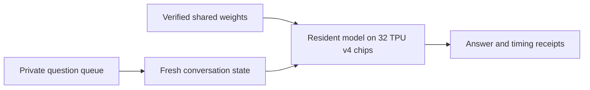

# GLM TPU

### GLM-5.3 FP8 inference in native JAX on 32 TPU v4 chips

A systems engineering project that takes a trained mixture-of-experts model
from checkpoint shards to completed answers: distributed weight placement,
sparse attention, expert routing, cache ownership and concurrent decoding.

**13.57 tokens/s for one chat · Keep the model loaded · Four-chat batching**

[Results](#measured-results) · [Layout](#repository-layout) ·
[Check without TPU hardware](#check-without-tpu-hardware) ·
[Run inference](#run-inference) · [Quickstart](#quickstart-from-the-weights-to-an-answer) · [Documentation](#documentation) ·
[License](#license)

## Engineering contribution

The central problem is making checkpoint placement, communication, compiler
memory use and independent conversation state agree across eight hosts and
32 TPU v4 chips.

| Area | Implementation |
|---|---|
| Distributed execution | An expert-8 x feature-4 device mesh keeps the hidden state sharded; every collective runs over one mesh axis, and full-pod exchanges are limited to small consensus values. |
| Model computation | Grouped routed experts over FP8 weights, resident BF16 non-routed weights, DSA sparse attention, native JAX and Pallas kernels. |
| Conversation state | Shared weights with independent caches and stopping; four-chat batching prefills prompts one after another and decodes them together. |
| Resident operation | Sequential requests reuse the loaded weights and compiled programs, with fresh state for each request. |
| Reproducibility | Verified checkpoint packing, source-bound launches, graph and memory admission, per-host token receipts, and a graph-equivalence harness that proves refactors leave the device programs unchanged. |

GLM's architecture, trained weights and tokenizer are reused. JAX, Pallas, XLA
and libtpu provide the compiler and runtime. The contribution is the TPU
implementation and its integration. [Architecture](docs/release/ARCHITECTURE.md) ·
[Notices](THIRD_PARTY_NOTICES.md).



## Measured results

**740 of 770 GSM8K questions scored correct: 96.1% on the evaluated subset.**
The owner stopped after test rows 0–769; 549 of the 1,319 test questions were not
run. The 30 unsuccessful cases include three that exhausted the context. This is an
ordered partial evaluation, not a full-test-set accuracy claim.
[Result receipt](docs/release/glm53-resident-results-20260922.json).

| Measurement | Result |
|---|---:|
| Single-chat decode, one completed answer | **13.57 tokens/s** |
| Decode across the 770-question sequential evaluation | **13.50 tokens/s** |
| Solo prompt prefill, 85 tokens | **0.965 s** |
| Solo decode, 239 timed tokens | **17.612 s** |
| Solo cold verification, loading and compilation | **1,219.89 s · 20.33 min** |
| Maximum observed HBM per chip, resident evaluation | **28.23 GB** |
| Four simultaneous chats, per active chat | **4.89–5.12 tokens/s** |

Output counts include thinking. Timings use the slowest host; the evaluation
rate is total timed decode tokens divided by summed per-question decode time.
It excludes prompt prefill, queue overhead and startup. The first output token
comes from prefill. Weights and compiled programs were reused across 770 questions;
every question started with independent conversation state.

The evaluation used greedy decoding, maximum thinking, full remaining 32K
allowances and a boxed-answer format instruction without a brevity instruction.
References stayed out of the model inputs. Scoring compares final-channel numbers
exactly; unfinished reasoning never counts as a correct answer. All-host token
agreement is checked separately. A checkable solo example is house profit:
`80,000 × 2.5 − (80,000 + 50,000) = 70,000`.

The separate [four-chat test](docs/release/glm53-four-answers-20260921.json)
completed four correct answers at normal EOS. Its mixed-length aggregate decode
was 9.27 tokens/s, distinct from each chat's speed.
[Timing boundaries and limitations](docs/release/STATUS.md).

## Repository layout

| Path | Contents |
|---|---|
| `glm_tpu/` | The engine package (`python -m glm_tpu`, console command `glm-tpu`). |
| `glm_tpu/entrypoints/` | The command line, the loopback chat UI, the OpenAI-compatible `/v1` API and their server. |
| `glm_tpu/executor/`, `glm_tpu/worker/` | The rank-0 controller that stages and launches a run on the fleet, and the per-host worker. |
| `glm_tpu/engine/`, `glm_tpu/runner/` | Requests, the per-request host loop and the resident protocol; program building, compilation and admission. |
| `glm_tpu/models/`, `glm_tpu/layers/`, `glm_tpu/kernels/` | GLM-5.3 (`glm_moe_dsa`), its per-shard layer bodies and the Pallas TPU kernels. |
| `glm_tpu/model_loader/`, `glm_tpu/distributed/`, `glm_tpu/config/` | The checkpoint pipeline, the multi-host runtime and mesh, the model and site configuration. |
| `tests/` | CPU tests, laid out like `glm_tpu/`; `tests/golden/` holds the equivalence records, `tests/reference/` an unsharded reference model. |
| `tools/equivalence/` | The graph-equivalence harness ([README](tools/equivalence/README.md)). |
| `examples/site.example.toml` | The template of the untracked site file that names the fleet, paths and checkpoint pins. |
| `docs/` | The documentation listed below. |

A map of every module is in [ARCHITECTURE](docs/release/ARCHITECTURE.md).

## Check without TPU hardware

Python 3.12 on Linux. Install into a new virtual environment (never into a
working TPU environment); [INSTALLATION](docs/release/INSTALLATION.md) has the
details and the other extras:

```bash
uv venv --python 3.12 .venv
uv pip install --python .venv/bin/python '.[runtime,dev]'
```

No weights, cloud credentials or TPU devices are needed for:

```bash
JAX_PLATFORMS=cpu .venv/bin/python -m glm_tpu info
JAX_PLATFORMS=cpu .venv/bin/python -m glm_tpu collect-env --profile runtime
JAX_PLATFORMS=cpu .venv/bin/python -m pytest -q -p no:cacheprovider tests/entrypoints/cli/test_main.py tests/entrypoints/cli/test_ask.py tests/entrypoints/cli/test_prepare.py tests/entrypoints/cli/test_collect_env.py tests/entrypoints/cli/test_checkpoint.py tests/engine/test_request.py tests/engine/test_llm_engine.py tests/executor/test_multihost_executor.py tests/executor/test_fleet.py tests/worker/test_tpu_worker.py tests/utils_/test_io_utils.py tests/config/test_site.py tests/runner/test_tpu_runner.py
```

These check the command line, request integrity and capacity refusals, the
controller's identity, SSH and failure gates, the checkpoint commands and the
delivery and deadline behaviour with synthetic CPU results, in about half a
minute. The full suite and the equivalence gates are described in
[TESTING](docs/release/TESTING.md). Tests establish software contracts; model
speed and answer evidence come from real weights on TPU.

## Run inference

Hardware inference needs a TPU v4 slice of **eight hosts with 32 chips** (Cloud
TPU accelerator type `v4-64`: the number counts TensorCores, two per chip; a
`v4-32` has 16 chips on four hosts, and the site file's fleet check refuses any
shape but 8 x 4), the verified GLM-5.3
owner checkpoint on every host, the topology binding assets, a clean published
checkout on an allowed branch and the pinned Python 3.12 environment (JAX/jaxlib
0.10.1, libtpu 0.0.41); the quickstart below produces the checkpoint and the
binding with this repository's commands. An untracked site file names all of it
([`examples/site.example.toml`](examples/site.example.toml)).
[Installation](docs/release/INSTALLATION.md) · [Checkpoint](docs/release/CHECKPOINTS.md) ·
[Operations](docs/release/OPERATIONS.md).

### Quickstart: from the weights to an answer

The steps in order, each with the page that has the details; every step is a
command of this repository. Commands run on rank 0 (host 0 of the slice) unless a
step says every host. The fleet commands (steps 7, 8 and 10) run only from a
clean checkout on a branch the site's `[launch]` policy allows, pushed to its
origin (by default `main` or `release/*`; [OPERATIONS](docs/release/OPERATIONS.md#before-a-launch)).

1. **Install** the pinned environment on every host at the same absolute path
   (the site's `fleet.worker_python`); the checkout is needed on rank 0 only
   ([INSTALLATION](docs/release/INSTALLATION.md)). On rank 0, from the checkout:

   ```bash
   uv venv --python 3.12 .venv
   uv pip install --python .venv/bin/python '.[runtime,tpu,dev]'
   ```

   On the other hosts, create the same environment at the same path (the same
   two commands in a copy of the checkout, or the [wheel](docs/release/INSTALLATION.md#the-wheel));
   the controller stages the source it runs from to every host. The commands
   below use this environment's `python`.

2. **Download the weights** at the pinned revision (141 safetensors shards,
   755,632,050,320 bytes, with the tokenizer and configuration files) to the
   directory the site file will name as `paths.model_path`, on every host (or on
   a mount every host sees). `hf` comes with the pinned `huggingface-hub`:

   ```bash
   hf download zai-org/GLM-5.3 --revision aca966e4e02791568aa6a4ced368624b3d897f42 --local-dir /path/to/GLM-5.3-FP8
   ```

3. **Mark the verified source**: hash every file and compare it with the
   Hugging Face repository ([CHECKPOINTS](docs/release/CHECKPOINTS.md#mark-the-source)).
   The report's `marker_sha256` is the site's `checkpoint.source_complete_sha256`;
   copy that same file into `paths.model_path` on every host (to check another
   host's copy of the weights, run the command there with `--upstream-marker`
   naming this marker and `--output` a scratch file; the copied file is the one
   the site pins):

   ```bash
   JAX_PLATFORMS=cpu python -m glm_tpu checkpoint mark-source /path/to/GLM-5.3-FP8
   ```

4. **Inventory the source**. Its report's `inventory_sha256` is the site's
   `checkpoint.source_inventory_sha256`; the file must lie inside
   `checkpoint.inventory_namespace`, at the same path on every host:

   ```bash
   JAX_PLATFORMS=cpu python -m glm_tpu checkpoint inventory /path/to/GLM-5.3-FP8 \
     --output /path/to/checkpoints/<inventory-tag>/source_inventory.json --model-id zai-org/GLM-5.3 \
     --revision aca966e4e02791568aa6a4ced368624b3d897f42
   ```

5. **Write the site file** from the example, owner-only, and fill in every
   `<...>` value ([the site file](docs/release/INSTALLATION.md#the-site-file)).
   A pin that a later step prints (the `[topology]` values of step 7, the
   manifest and SUCCESS digests of step 8) is 64 zeros until then. Name the
   checkpoint root `greenfield_ws32_runtime_pack_<YYYYMMDD>T<HHMMSS><9 digits>Z`
   directly inside `checkpoint.namespace` (the pack run takes its name), and set
   `topology.slice_name` (the TPU name) before step 7, which records it:

   ```bash
   mkdir -p ~/.config/glm-tpu
   cp examples/site.example.toml ~/.config/glm-tpu/site.toml
   chmod 600 ~/.config/glm-tpu/site.toml
   ```

6. **Check the environment** on every host
   ([INSTALLATION](docs/release/INSTALLATION.md#check-an-environment)):

   ```bash
   JAX_PLATFORMS=cpu python -m glm_tpu info
   JAX_PLATFORMS=cpu python -m glm_tpu collect-env --profile tpu
   ```

7. **Capture the topology and bind it**, with the fleet idle: a model-free job of
   about a minute on the TPUs, then the binding of its run
   ([OPERATIONS](docs/release/OPERATIONS.md#the-topology-binding)). Copy the
   printed `binding_dir`, `binding_sha256`, `capture_root`, `topology_sha256`,
   `topology_fleet_sha256`, `mesh_sha256` and `slice_name` into the site's
   `[topology]` table:

   ```bash
   JAX_PLATFORMS=cpu python -m glm_tpu topology capture --site ~/.config/glm-tpu/site.toml
   JAX_PLATFORMS=cpu python -m glm_tpu topology bind /path/to/runs/<capture run> --output /path/to/binding
   ```

8. **Pack and seal the checkpoint** on the eight hosts (CPU, hours; about 107 GB
   of free tmpfs per host, and lingering or `RemoveIPC=no` first;
   [CHECKPOINTS](docs/release/CHECKPOINTS.md#packing)). `--preflight-only` runs
   every host's checks first. Copy the printed `manifest_sha256` and
   `success_sha256` into the site's `[checkpoint]` table:

   ```bash
   JAX_PLATFORMS=cpu python -m glm_tpu checkpoint pack --site ~/.config/glm-tpu/site.toml --preflight-only
   JAX_PLATFORMS=cpu python -m glm_tpu checkpoint pack --site ~/.config/glm-tpu/site.toml
   ```

9. **Verify the packed checkpoint** on every host, which holds its four slots
   (the pack report's `installed` rows and the binding's `host_to_slots` name
   them; the site file must then be on every host, at the same path), then run
   the worker preflight against the real site file on rank 0 with the fleet idle
   ([CHECKPOINTS](docs/release/CHECKPOINTS.md#inventory-and-verify-on-local-files),
   [TESTING](docs/release/TESTING.md)):

   ```bash
   JAX_PLATFORMS=cpu python -m glm_tpu checkpoint verify --site ~/.config/glm-tpu/site.toml --slots <four slots> --local-slot-layout
   GLM_TPU_TEST_SITE=~/.config/glm-tpu/site.toml JAX_PLATFORMS=cpu python -m pytest -p no:cacheprovider tests/worker/test_local_preflight.py -m site
   ```

10. **Start a resident session and ask** from rank 0 when the fleet is idle (next
    section). It prints `RUN <run directory>`, answers (`RESIDENT_RESULT ...`),
    and keeps the model loaded for the questions that follow
    ([ordinary inference](docs/release/OPTIMIZED_INFERENCE.md)).
11. **Open the chat UI or the `/v1` API** on that session, once it has answered
    (below).

### A resident session

To start a session from rank 0 when the fleet is idle:

```bash
JAX_PLATFORMS=cpu python -m glm_tpu ask "Your question" --keep-loaded --wall-seconds 14400
```

The default is **32,768 combined input/history/thinking/output slots**
(`--context 8k|32k|128k|256k`: 8,192, 32,768, 128K prompt / 163K total
(166,912 slots) or 262,144). The runtime reserves the cache and compiles fixed
shapes at startup; shorter questions do not have to fill that capacity. Omitting
an output cap gives the answer every remaining slot. Thinking is enabled at
maximum effort.

The command prints a private run directory and leaves the model loaded after
answering. Later prepared requests go to that session's inbox; they do not start
another model. Full history must be supplied to continue a conversation.
[Submission, stopping and four-chat usage](docs/release/OPTIMIZED_INFERENCE.md).

### The chat UI and the `/v1` API

For a browser workspace, the [chat UI](docs/UI.md) attaches to an existing
resident session: saved conversations, streamed answers, thinking, light/dark
themes and a mobile layout. Forward its loopback port 8011 to open it locally.
The model stays loaded when the UI closes. The same server also exposes a
stateless [OpenAI-compatible `/v1` API](docs/API.md) with tool calling and
streaming, for local development tools.

Start the server on rank 0 once the session has answered its first request (the
controller printed `RESIDENT_RESULT`), with `--run` the directory it printed as
`RUN <directory>`. The session may have been started by `glm-tpu ask ...
--keep-loaded` or as the controller module with `--keep-loaded`; the server
finds and authenticates the controller from that run directory's own records
([how](docs/UI.md#open-the-workspace)):

```bash
JAX_PLATFORMS=cpu python -m glm_tpu.entrypoints.serve.server \
  --run /absolute/path/to/resident-run \
  --state /absolute/path/outside-the-repository/private-chats \
  --port 8011
```

Open http://127.0.0.1:8011 through the forwarded port and ask, or call the API
with the key the server created at `<state>/api-key` on rank 0:

```bash
export GLM_API_KEY="$(ssh <rank-0 host> cat /absolute/path/outside-the-repository/private-chats/api-key)"
curl -s http://127.0.0.1:8011/v1/chat/completions \
  -H "Authorization: Bearer $GLM_API_KEY" -H "Content-Type: application/json" \
  -d '{"model": "glm-5.3", "messages": [{"role": "user", "content": "Your question"}]}'
```

### Scope

This is a single-site engine with a private file queue, a local chat UI and a
key-authenticated loopback API. There is no automatic recovery of live model or
KV state after a process failure. Resident mode serves sequential requests;
four-chat batching is a separate invocation. Short prompts do not establish
full-32K-input quality. Public benchmark familiarity and the owner-selected
stopping point limit the interpretation of the partial score.

## Documentation

| Page | For |
|---|---|
| [Project summary](docs/release/PROJECT_SUMMARY.md) | the problem, approach, results and limits on one page |
| [Installation](docs/release/INSTALLATION.md) | environments, extras, `collect-env`, the wheel, the site file |
| [Ordinary inference](docs/release/OPTIMIZED_INFERENCE.md) · [Four conversations](docs/release/CONCURRENT.md) | `ask`, resident sessions, the inbox, stopping, batching |
| [Chat UI](docs/UI.md) · [Local API](docs/API.md) | the browser workspace and the `/v1` API |
| [Checkpoint](docs/release/CHECKPOINTS.md) | the pinned model, the packed owner files, `checkpoint inventory` and `checkpoint verify` |
| [Operations](docs/release/OPERATIONS.md) | the controller, launch policy, locks, failure handling and diagnosis |
| [Architecture](docs/release/ARCHITECTURE.md) | the module map, the request path, parallelism and numerical conventions |
| [Testing](docs/release/TESTING.md) · [Equivalence harness](tools/equivalence/README.md) | the test layout, tiers and gates |
| [Reviewer guide](docs/release/REVIEWER_GUIDE.md) | a reading order and the source package |
| [Release status](docs/release/STATUS.md) · [Migration history](docs/release/GLM53_MIGRATION.md) | the measured GLM-5.3 release, the TPU comparison of this tree, and how the release was reached |
| [Handoff](HANDOFF.md) · [Goal](goal.md) · [Agent instructions](AGENTS.md) | the current state, the goal and the working rules |
| [Contributing](CONTRIBUTING.md) · [Security](SECURITY.md) | the development policy and the release checks |

## History

The GLM-5.2 implementation and measurements are preserved at the tag `glm-5.2`;
its weight payloads were retired. The research tree this release was cut from
(research history, the curation ledger, the legacy sampled and long-context
interfaces, benchmarks and their evidence) is preserved at the tag
`archive/research-20260922`; for example
`git show archive/research-20260922:docs/perf/README.md`.

## License

Copyright 2026 Gianluigi Vitale. The project's own work is licensed under the
[Apache License 2.0](LICENSE). Third-party material keeps its own license: the
GLM-5.3 configuration files under `glm_tpu/models/glm_moe_dsa/hf_config/` are
under Z.AI's GLM-5.3 license ([notices](THIRD_PARTY_NOTICES.md)).

Maintained by **Gianluigi Vitale**. The repository is private. Review is
assistant self-review, not independent review.
