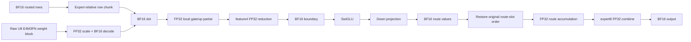
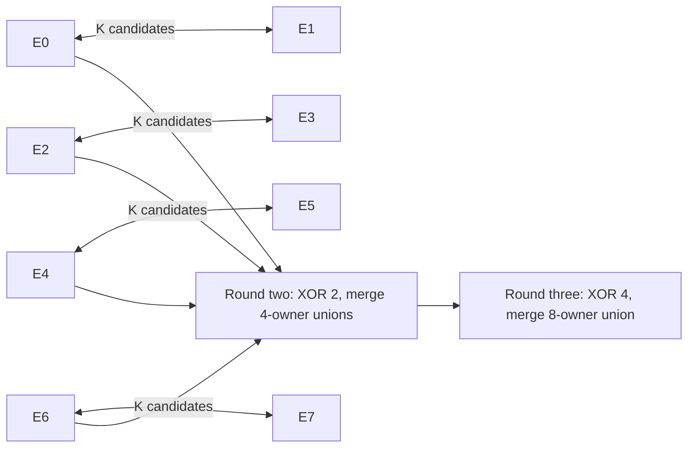
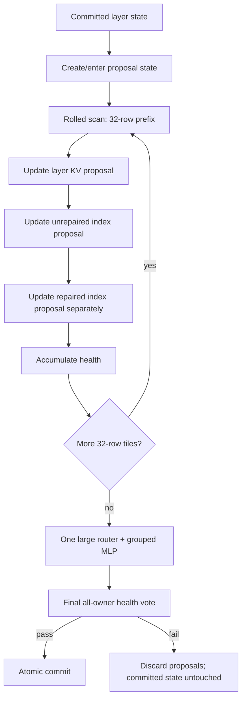

# TPU-v4 GLM-5.2 Prefill: Weight Reuse, Exact DSA Selection, Rolled Layer Windows, and the Numerical Boundary

## Executive summary

The three attached kernels expose three distinct problems, and they should not be solved in the same order.

**First, the current B128 layer-window numerical failure needs one small localization experiment before more performance work is promoted.** The supplied failure is unusually informative: the first DSA disagreement is already at row 2; the B128 and four-B32 paths enter attention with bit-identical BF16 normalized input; later cache divergences cannot causally explain row 2; and the first selected-set differences only appear later because this 4096-capacity fixture has fewer than 2048 visible keys for most rows. The missing evidence is therefore not another whole-layer rerun. It is the actual row-2 DSA operands at the scorer boundary, followed—only if needed—by the completed post-attention BF16 router input. fileciteturn0file0

**Second, the grouped FP8 kernel really does have a source-level weight-reuse problem.** Its Pallas grid is

```text
(N tile, active group-row tile, K tile)
```

and every `(ni, gi, ki)` invocation loads the weight block selected by `ids[gi]`, converts raw U8 bits to E4M3FN, casts to FP32, multiplies by the scale, rounds to BF16, and only then performs the BF16 dot with FP32 accumulation. There is no explicit expert-weight cache in scratch VMEM. Consequently, whenever the same expert occupies several active row tiles, the same `(expert, N-tile, K-tile)` block is presented to the Pallas pipeline and decoded again for every such visit. Physical CMEM/HBM caching may reduce actual external traffic, but the source does not guarantee that reuse. fileciteturn0file3 The pinned JAX 0.10.1 MegaBlox GMM on which this code is based uses the same `(tiles_n, num_active_tiles, tiles_k)` grid and FP32 `[tm, tn]` accumulator pattern. fileciteturn9file0

For your B512/B1024 targets, my first reuse kernel would therefore be **expert-relative, M32 × N256 × K128**, not merely `row_tile=32` in the existing global-row schedule. The distinction matters: `make_group_metadata` aligns tiles to the global sorted-route row space, so an expert beginning in the middle of a 32-row tile can still be revisited. An expert-relative schedule should instead process up to 32 contiguous rows belonging to one expert as one reuse unit, with route-workspace starts aligned to TPU's row tiling and padded entries masked from all stores and later route-slot combination. The existing route-slot identity must remain attached to every live row so the admitted FP32 route-sum order is unchanged. The current MegaBlox metadata explicitly creates additional visits when groups start within an M tile, explaining why increasing `tm` alone is not equivalent to expert-relative blocking. fileciteturn9file0

Under the simple mean-occupancy scenarios in your brief, the source-level raw-weight traffic for the three routed projections falls from approximately **576 MiB to 288 MiB per chip at B512**, and from **1,152 MiB to 288 MiB at B1024**, assuming all 32 local experts are active and each M32 expert chunk requires one weight sweep. Those are derived logical weight-block payloads, not measured HBM transactions. Each gate, up, or down expert shard contains exactly 3 MiB of raw 8-bit weights. fileciteturn0file5

**Third, the DSA selection algorithm should be changed from “candidate generation followed by potentially expensive repeated generic merges” to “exact local partial selection plus linear merge of sorted K-lists.”** The current `prefill_dsa.py` carries `[rows, 2048]` scores and positions through every key tile, calls `local_topk_candidates`, and calls `merge_topk_candidates_with_scores` after every visible tile. Across expert8 it then all-gathers all eight candidate lists and performs another merge. fileciteturn0file2 The helper implementations were not among the three attached kernels, so I cannot truthfully say whether those helpers currently lower to a full sort, `top_k`, or a more specialized network. The first measurement must inspect their optimized HLO.

The algorithm I recommend is:

1. exact local top-2048 from each score tile;
2. impose the total ordering **score descending, absolute position ascending**;
3. thereafter merge two already-sorted 2048-element lists in **O(K)** rather than sorting 4096 elements again;
4. replace the expert8 all-gather with a **three-round butterfly top-K reduction**, where every round exchanges one `[rows, 2048]` score/position summary and merges it.

At 32 rows, one score/position list is 512 KiB. The existing all-gather materializes 4 MiB of candidate data per receiver; a three-round butterfly exchanges 1.5 MiB per rank and never requires an eight-list candidate tensor. This is an exact associative reduction because `TopK_K(A ∪ B)` under a total comparator is associative.

**Fourth, do not extend `ws32_prefill_window.py` from four tiles to sixteen or thirty-two by extending its Python `for` loop.** The attached function creates a Python `prefixes` list and statically invokes the prefix layer once for each 32-row slice. fileciteturn0file4 Your own B128 compile evidence already shows the cost of only four such prefixes: code grows to 49,431,552 bytes and temporary allocation to 203,686,912 bytes versus 17,125,888 and 96,066,560 for B32. fileciteturn0file5 At 16/32 tiles the right representation is a **rolled `lax.scan(..., unroll=1)`** carrying only the latest proposal KV cache, unrepaired index cache, repaired index cache, health state, and small scalar metadata. JAX 0.10.1's own implementation documents that `scan` lowers to one `WhileOp` specifically to avoid the large XLA computations produced by Python-loop unrolling. fileciteturn7file0

**Finally, INT8 is not the first lever.** A real W8A16 GLM-5.2 release exists, and its MoE expert weights are channelwise INT8, but it is published for `compressed-tensors`/vLLM and was verified on 8×H200, not TPU v4. citeturn16view0 vLLM Ascend also publishes GLM-5.2 W8A8 weights, but validates those on Atlas A2/A3 hardware. citeturn17search0 TPU v4 hardware does have an 8-bit mode and Google specifies the **same 275 teraops/s peak for BF16 and INT8**, not a 2× INT8 compute rate. citeturn15view0 Current Pallas hardware documentation lists v4 FP8 and INT8 peak entries as unavailable, despite the underlying chip's documented 8-bit support, so the exact JAX 0.10.1 Mosaic lowering must be established experimentally. citeturn14search1 More importantly, W8A16 still needs high-precision activations and therefore does not automatically turn the matrix multiply into INT8×INT8. It mainly changes the weight decode path. Your existing FP8 and an INT8 checkpoint are both one byte per weight, so INT8 does not solve repeated expert-weight loading.

The decision sequence I would use is therefore:

| Priority | Decision |
|---|---|
| **Immediate** | Localize row-2 B128 DSA divergence with a tiny same-graph operand capsule. |
| **Next kernel change** | Implement expert-relative M32 weight reuse, retaining current FP8 checkpoint and numerical boundaries. |
| **Parallel low-risk work** | Replace DSA generic repeated merge/all-gather with sorted linear merge + expert8 butterfly. |
| **Before B512/B1024 full-layer work** | Convert the 32-row prefix loop to a rolled `lax.scan(unroll=1)`. |
| **Only afterward** | Run one exact-shape INT8 lowering/microbenchmark; do not download or convert a full checkpoint first. |

## What the three kernels actually execute

### The grouped FP8 projection is row-stationary enough for the accumulator, not weight-stationary across expert rows

The central portion of `prefill_grouped_fp8.py` is effectively:

```python
grid = (tiles_n, active_tiles, tiles_k)

ni = program_id(0)
gi = program_id(1)
ki = program_id(2)

x     = lhs[row_tiles[gi], ki]
w_u8  = weights[ids[gi] - group_offset, ni, ki]
scale = scales[ids[gi] - group_offset, ...]

decoded = (
    bitcast_u8_to_e4m3fn(w_u8).astype(float32)
    * block_scale(scale, ki, ni)
).astype(bfloat16)

acc[row_tile, bn] += dot(
    x_bf16,
    decoded_bf16,
    preferred_element_type=float32,
)
```

with an explicit VMEM F32 accumulator of shape `[row_tile, bn]`. fileciteturn0file3

That loop order has one useful property: `ki` is the innermost arbitrary dimension, so the FP32 accumulator stays attached to a given output row tile/N tile as K is reduced. That is precisely the reduction order you should preserve.

The bad property is that **`gi` identifies an active group-row visit, not an expert whose weights stay resident while all its rows execute**. Thus:

```text
expert E, row visit 0:
    load/decode W[E, n0, k0]
    load/decode W[E, n0, k1]
    ...
expert E, row visit 1:
    load/decode W[E, n0, k0]   <-- same block again
    load/decode W[E, n0, k1]   <-- same block again
    ...
```

The source-level repeat count for one expert and one projection is approximately the number of active M tiles assigned to that expert, with additional boundary visits possible when an expert begins partway through a global M tile. That behavior comes directly from MegaBlox's `make_group_metadata`: group starts are rounded down, group ends rounded up, and a group starting inside an existing tile creates an additional visit of that tile. fileciteturn9file0

There is **no weight scratch buffer** in the attached kernel. Its only explicit scratch allocation is:

```python
pltpu.VMEM((row_tile, bn), jnp.float32)
```

for the accumulator. fileciteturn0file3 The U8 weight, scale and BF16 LHS blocks arrive through Pallas `BlockSpec`s. Pallas normally moves call arguments from HBM into VMEM windows before the kernel operates on them; scratch buffers are persistent across pipeline iterations. citeturn14search0 Thus a backend cache may rescue some repeated accesses, but that is a compiler/hardware effect to measure, not a reuse property the kernel expresses.

This is also not a peculiar artifact of your rewrite. The pinned JAX 0.10.1 MegaBlox GMM uses the same forward GMM grid:

```text
(tiles_n, num_active_tiles, tiles_k)
```

with `("parallel", "arbitrary", "arbitrary")` dimension semantics and an F32 `[tm, tn]` scratch accumulator. fileciteturn9file0 Your adaptation inherited a schedule designed for conventional grouped BF16 matmul and added raw-FP8 decoding inside each visit.

### The FP8 numerical boundary is already explicit and should remain so

Your kernel does **not** perform an FP8 matrix multiply. It:

1. reads raw U8 checkpoint storage;
2. bitcasts it to E4M3FN;
3. promotes to FP32;
4. applies the FP32 128×128 block scale;
5. rounds the reconstructed weight block to BF16;
6. performs a BF16-input/BF16-weight dot;
7. requests FP32 output/accumulation. fileciteturn0file3

That means weight reuse can be fixed without moving the admitted model interfaces. For routed gate/up, the broader brief requires local projection partials to remain FP32, then an FP32 feature4 reduction, **then** a BF16 boundary before SwiGLU. Down projection and route-weight products are BF16, followed by restored route-slot ordering and FP32 accumulation, an FP32 expert8 combination, and BF16 output. fileciteturn0file5

The proposed optimization therefore changes:

```text
how often W is fetched/decoded
```

not:

```text
where the model rounds or reduces.
```

That distinction is essential.



### The DSA kernel is bounded in score memory but pays selection work once per key tile

`causal_dsa_local_candidates` is already substantially better than dense full-context DSA. It restricts rows to 32, uses key tiles of at most 4096, physically skips future-only tiles with `lax.cond`, and carries only `[rows, top_k]` score/position candidates from tile to tile. fileciteturn0file2

Its control structure is:

```python
for key_tile in range(num_key_tiles):
    visible = positions < valid_lengths

    if any(visible):
        scores = dsa_scores(query, key_block, head_weights)
        new = local_topk_candidates(scores, ...)
        carry = merge_topk_candidates_with_scores(carry, new)
```

followed by:

```python
scores    = lax.all_gather(local.scores,    "expert")
positions = lax.all_gather(local.positions, "expert")
selected  = merge_topk_candidates_with_scores(scores, positions, ...)
```

across expert8. fileciteturn0file2

This is structurally sound for memory. The open question is the cost of `local_topk_candidates` and `merge_topk_candidates_with_scores`; those helpers were not attached. You should **not** rewrite selection until the optimized HLO tells you whether those are full sorts or TPU partial-selection operations.

One memory number is worth highlighting. The file's own admission comment bounds the largest conceptual per-head score temporary at `32 × 32 × 4096` F32 values, i.e. 16 MiB. fileciteturn0file2 Current Pallas hardware documentation gives TPU v4 **16 MiB of VMEM per TensorCore** and two TensorCores per chip. citeturn14search1 That does not prove the generic-JAX DSA scorer puts the entire conceptual tensor in one TensorCore's VMEM—the compiler can fuse/stream/spill—but it makes eliminating a physically materialized `[rows, heads, key_tile]` intermediate particularly valuable once selection correctness is settled.

### The layer window is statically unrolled today

`ws32_prefill_layer_window_mapped` literally contains:

```python
prefixes = []
for tile_start in range(0, rows, 32):
    ...
    result = ws32_prefill_transformer_layer_mapped(..., prefix_only=True)
    cache_local = result.cache_local
    unrepaired_index_cache = result.unrepaired_index_cache
    repaired_index_cache = result.repaired_index_cache
    prefixes.append(result)

normalized = concatenate(prefix.normalized_mlp_local ...)
output = ws32_prefill_mlp_mapped(normalized, ...)
```

fileciteturn0file4

For B128, four prefix bodies are therefore present in the traced program. Your DB590 compiler evidence is consistent with significant graph-size amplification already at four iterations: the B128 window reports 49.43 MB of code and 203.69 MB of temporary allocation, compared with 17.13 MB and 96.07 MB for B32. Those are compile allocations, not execution-peak memory, but they make 16× or 32× Python unrolling an unattractive experiment. fileciteturn0file5

Pinned JAX 0.10.1 provides the mechanism you need: its `lax.scan` documentation in source explicitly says the primitive lowers to a single `WhileOp`, while native Python loops in `jit` are unrolled and can generate large XLA computations; `unroll=False` or `unroll=1` leaves the loop rolled. fileciteturn7file0

## A weight-stationary grouped-MoE schedule for B512 and B1024

### The important change is expert-relative row blocking

Simply changing:

```python
row_tile=8
```

to:

```python
row_tile=32
```

is a useful control experiment, but it is **not the final reuse design**. The existing metadata's M tiles live in the global sorted-row coordinate system. An expert can straddle global M-tile boundaries, and MegaBlox deliberately revisits partial boundary tiles so each group can mask its own rows. fileciteturn9file0

The desired schedule is:

```text
expert
  -> expert-relative row chunk
      -> N panel
          -> K tile
```

where a row chunk contains rows of **one expert only**.

For the first implementation I recommend:

| Parameter | Primary setting | Alternative to benchmark |
|---|---:|---:|
| Expert row chunk M | **32** | 16 at B512; 64 for skewed B1024 |
| N panel | **256** | 512 |
| K tile | **128** | keep fixed initially |
| Raw-weight pipeline | double buffered | do not add triple buffering first |
| Decoded BF16 weight | two alternating VMEM buffers | one if compiler schedules decode/MXU adequately |
| LHS pipeline | double buffered | same |
| Accumulator | one F32 `[M,Npanel]` | one per gate/up when interleaved |

The installed JAX 0.10.1 public TPU API already exports `emit_pipeline`, and its pinned Mosaic pipeline implementation describes `BufferedRef` as automating **VMEM double buffering**. fileciteturn12file0 fileciteturn10file0 Current Pallas documentation likewise describes HBM→VMEM pipelining and says TPU pipelining is normally double-buffered; more stages consume SRAM and increase bubbles. citeturn14search0turn14search3 I would therefore not design around triple buffering until a trace establishes DMA latency that double buffering cannot hide.

### Concrete pseudocode

A practical interface is to keep your existing sorted route representation but create a small **expert execution descriptor**:

```python
# Generated from the existing exact route sort.
# No change to live route order/identity.
expert_start[e]   # start in packed execution rows, 8-row aligned
expert_count[e]   # live rows
route_slot[row]   # original route-slot identity; -1 for padding
```

Expert starts should be padded only enough to meet the TPU row-transfer/tile alignment required by the pinned backend, rather than padding every group to a full 32 rows. Padding is internal execution metadata; padded rows never participate in route combination.

Conceptually:

```python
M_CHUNK = 32
N_PANEL = 256
K_TILE = 128

for expert in local_experts:
    m_live = expert_count[expert]

    for m0 in range(0, m_live, M_CHUNK):
        # One chunk contains only this expert's live rows.
        # Invalid tail lanes are zero/masked.

        for n0 in range(0, N, N_PANEL):
            acc = zeros([M_CHUNK, N_PANEL], float32)

            # emit_pipeline / double-buffered K loop
            for k0 in range(0, K, K_TILE):
                # asynchronous HBM -> VMEM for next iteration
                w_raw = W_u8[expert, n0:n0+N_PANEL, k0:k0+K_TILE]
                s = scale[expert, n0//128:(n0+N_PANEL)//128,
                                    k0//128]

                # This boundary is unchanged from the existing kernel.
                w = (
                    bitcast_e4m3fn(w_raw).astype(float32)
                    * s
                ).astype(bfloat16)

                x = packed_lhs[
                    expert_start[expert] + m0:
                    expert_start[expert] + m0 + M_CHUNK,
                    k0:k0+K_TILE,
                ].astype(bfloat16)

                acc += dot_general(
                    x, w,
                    preferred_element_type=float32,
                )

            store_only_live_rows(acc)
```

For gate and up, an optional second version keeps the same X tile in VMEM and performs both dots:

```python
for k0:
    x = load_x_once(...)

    gate_w = decode_bf16(gate_u8, gate_scale)
    up_w   = decode_bf16(up_u8,   up_scale)

    gate_acc += dot_f32(x, gate_w)
    up_acc   += dot_f32(x, up_w)

# NO SwiGLU HERE.
gate = feature4_fp32_reduce(gate_acc)
up   = feature4_fp32_reduce(up_acc)

gate = gate.astype(bfloat16)
up   = up.astype(bfloat16)

y = swiglu(gate, up)
```

This **shares the activation read and scheduling overhead**. It does not reduce gate/up raw weight bytes, because the two weight matrices are genuinely different. Most importantly, it does not commit the invalid generic fusion in which each feature shard applies SwiGLU before feature4 reduction. Your required FP32-reduction/BF16-activation boundary remains exactly where it is today. fileciteturn0file5

### VMEM budget

TPU v4 has two TensorCores per chip; current JAX hardware documentation reports 16 MiB VMEM per TensorCore. citeturn14search1 Google independently documents two TensorCores with four MXUs each per v4 chip. citeturn15view0

The following are **logical payload reservations**, not compiler-reported physical VMEM allocations. They intentionally leave the overwhelming majority of the 16 MiB budget available for compiler tiling, registers and Pallas infrastructure.

For M32/N256/K128:

| Item | Payload |
|---|---:|
| two raw U8 weight buffers | 64 KiB |
| two decoded BF16 weight buffers | 128 KiB |
| two BF16 X buffers | 16 KiB |
| F32 accumulator `[32,256]` | 32 KiB |
| F32 output/staging reservation | 32 KiB |
| scale/vector staging reserve | 8 KiB |
| **Approx. one projection** | **280 KiB** |
| **Gate+up interleaved, shared X** | **≈544 KiB** |

For an aggressive M64/N512 version:

| Item | Approx. payload |
|---|---:|
| one projection | **≈680 KiB** |
| gate+up interleaved | **≈1.30 MiB** |

Even the latter is only about 8% of the documented 16 MiB/TensorCore VMEM capacity, before compiler-specific overhead. The conclusion is not “therefore M64/N512 is fastest”; it is that **VMEM capacity is not the reason to keep re-decoding a 128×128 weight block every eight routed rows**. citeturn14search1

### Logical HBM traffic for the exact local shapes

Each local gate/up expert has:

```text
2048 × 1536 × 1 byte = 3,145,728 B = 3 MiB
```

and down has the same element count:

```text
1536 × 2048 × 1 byte = 3 MiB.
```

Thus a complete raw-weight sweep through gate + up + down is **9 MiB per local expert**, excluding scales. Those shapes are supplied project facts. fileciteturn0file5

Under the intentionally simple mean-occupancy cases:

| Prompt group | Mean routes/expert | Current M8 ideal visits/expert | Current three-projection logical weight payload, 32 local experts | Expert-relative M32 payload | Raw-weight reduction |
|---|---:|---:|---:|---:|---:|
| B512 | 16 | 2 | 576 MiB | 288 MiB | **2×** |
| B1024 | 32 | 4 | 1,152 MiB | 288 MiB | **4×** |

These are **derived ideal scenario numbers**. Real routes can produce more chunks, and the existing global M8 metadata can add boundary revisits. Conversely, CMEM/pipeline behavior can mean not every logical repeated block becomes a new HBM transaction. That uncertainty is exactly what the measurement below resolves. fileciteturn0file3 fileciteturn9file0

At Google's documented 1,200 GB/s chip HBM bandwidth, those byte counts correspond only to raw-weight-transfer floors of roughly 0.50 ms→0.25 ms at B512 and 1.01 ms→0.25 ms at B1024. Those are **not predicted MoE latencies**: they exclude MXU work, FP8 decode, scales, route movement, collectives, shared expert work, synchronization and owner imbalance. citeturn15view0 Your actual DB589 12.028 ms distributed B128 MoE time is consequently a much more important end-to-end anchor than the bandwidth-only floor. fileciteturn0file5

### Why the one-owner B128 case is slow despite perfect tile occupancy

Your DB589 result—29.283 ms for concentrated routing versus 12.028 ms distributed, even though the concentrated case has useful lane fraction 1.0—strongly suggests that **lane occupancy is not the governing metric once work is concentrated on one expert owner**. fileciteturn0file5

The main hypotheses, in the order I would test them, are:

| Hypothesis | Smallest discriminator |
|---|---|
| Expert-owner straggler dominates the critical path | Per-owner Pallas/MoE completion timestamps; compare max owner vs median |
| One owner saturates its HBM/DMA path while others idle | `accelerator/memory_bandwidth_utilization` plus per-owner trace interval |
| Weight decode/vector work saturates the active owner | Compare ordinary FP8 kernel against “already-decoded BF16 *selected layer only*” diagnostic, without creating a checkpoint |
| MXU work is underlapped with DMA/decode | XProf timeline around grouped kernel; compare TensorCore utilization and memory utilization |
| Collective waits expose the slow owner | Measure collective start→finish relative to each owner's local GMM completion |

Google documents `accelerator/tensorcore_utilization`, `accelerator/memory_bandwidth_utilization`, `accelerator/memory_used`, duty cycle, and TensorCore idle-duration metrics for v4 and newer. citeturn18search1 These Cloud Monitoring metrics are coarsely sampled and cannot prove per-kernel HBM bytes. For the decisive short interval, use an XProf/XPlane capture, which Google recommends for profiling specific blocks of JAX/XLA computation. citeturn18search0

### The decisive reuse measurement

Do **not** infer reuse from faster wall time alone.

Run the same selected real MoE layer and the same captured route assignments through:

```text
A: current row_tile=8 kernel
B: current kernel with row_tile=32
C: expert-relative M32/N256/K128 reuse kernel
```

at both B512 and B1024. This three-way comparison separates “larger M tile helped” from “we actually eliminated expert-boundary revisits.”

For each projection record a deterministic **logical fetch count**:

\[
F_\text{old}
  = \sum_{\text{active gi}}
      N_\text{tiles}K_\text{tiles}
\]

and

\[
F_\text{new}
  = \sum_e
      \left\lceil \frac{M_e}{32}\right\rceil
      N_\text{tiles}K_\text{tiles}.
\]

This metric is available directly from route metadata and proves what the schedule asks the compiler to load.

Then record synchronized device p50/p99 and a short XPlane profile. The physical pass criteria I would preregister are:

**Correctness:** all existing grouped-MoE numerical contracts pass, including the same FP32 feature4 reduction → BF16 → SwiGLU boundary and the admitted FP32 route-slot accumulation order. No route ID/order changes.

**Schedule:** the C path's logical weight-block count must equal the expert-relative formula above. If not, the implementation did not actually solve reuse.

**Performance:** on approximately 16 routes/expert, C should materially beat A; on approximately 32 routes/expert, the B1024 gain should be larger. If C is not faster despite a large logical-fetch reduction, the trace should demonstrate whether decode, MXU, padding or another phase became dominant before adopting the design.

**HBM evidence:** use XProf plus the documented memory-bandwidth-utilization signal, but do not invent “HBM bytes read” if your installed XProf does not expose it. The Cloud metric is a utilization percentage, not a per-op byte counter. citeturn18search1

That is a decisive result: either repeated weight presentation is a major component and C wins, or the experiment falsifies the hypothesis and prevents weeks of further reuse work.

## Efficient exact top-2048 selection

### Preserve a total comparator, not merely a top-K set

The required comparator should be explicit:

```python
def better(a_score, a_pos, b_score, b_pos):
    return (
        (a_score > b_score)
        | ((a_score == b_score) & (a_pos < b_pos))
    )
```

with invalid/sentinel entries ordered behind every live entry.

This preserves:

```text
primary:   exact executing FP32 score, descending
secondary: absolute position, ascending
```

and does not perturb FP32 scores to manufacture tie-breaking.

This matters because pinned JAX 0.10.1's `lax.top_k` signature is:

```python
top_k(operand, k, *, axis=-1)
```

and does **not** expose the newer `is_stable` option. fileciteturn5file0 Current JAX does expose stable top-K behavior, but that is not your installed API and should not be silently assumed. citeturn13search1

### Recommended local algorithm

The least risky exact improvement is a two-stage design.

For each 4096-key score tile:

```python
# Conceptual pseudocode.
scores = exact_existing_dsa_scores(...)   # do not change scorer yet
scores = mask_invalid(scores, -inf)

# Fast partial selection determines the Kth score threshold.
v, idx = lax.top_k(scores, 2048)
tau = v[..., -1]

# Every score > tau must be selected.
# For score == tau, select the lowest absolute positions needed.
membership = repair_cutoff_ties_exactly(
    scores=scores,
    positions=positions,
    threshold=tau,
    top_k=2048,
)

cand_scores, cand_pos = compact_K(membership)

# Sort only the retained 2048 by the full exact comparator.
cand_scores, cand_pos = lexicographic_sort_K(
    score_desc=True,
    position_asc=True,
)
```

The cutoff repair is necessary because an unstable `top_k` may choose arbitrary members when more than the required number of entries share the Kth score. The final K-element lexicographic ordering repairs equal-score ordering at **every** score, not only at the cutoff.

Whether that beats a single lexicographic sort of all 4096 entries on TPU v4 is an empirical question. The point is that you only need to benchmark those two **local selection** alternatives. You do not need a global algorithm redesign first.

### Once candidate lists are sorted, never generic-sort them again

For carried candidates, use an exact two-way merge:

```python
def merge_topk_sorted(a_score, a_pos, b_score, b_pos, K=2048):
    # Standard merge of two already sorted streams.
    i = j = o = 0
    while o < K:
        take_a = better(a_score[i], a_pos[i], b_score[j], b_pos[j])
        out_score[o] = where(take_a, a_score[i], b_score[j])
        out_pos[o]   = where(take_a, a_pos[i],   b_pos[j])
        i += take_a
        j += ~take_a
        o += 1
    return out_score, out_pos
```

A TPU implementation should vectorize/block this rather than literally run scalar Python, but the algorithmic property is what matters: **O(K)** comparison/routing work per merge and no repeated sorting of 2K candidates.

For K=2048, one merge needs at most 4095 comparator decisions. A 4096-element comparison sort is on the order of \(N\log N\) comparisons before TPU-specific network details. The exact crossover depends on the lowering, so benchmark the actual compiled primitive rather than treating comparison counts as cycle counts.

### Replace the expert8 all-gather with a butterfly Top-K all-reduce

Your current distributed path all-gathers:

```text
scores:    [8, rows, 2048] F32
positions: [8, rows, 2048] I32
```

and then merges. fileciteturn0file2

At rows=32:

```text
one owner list =
    32 × 2048 × (4 + 4)
  = 524,288 B
  = 512 KiB
```

and the all-gather result is 8× that = **4 MiB per receiver**.

Instead:

```python
scores, pos = local_sorted_topk

for xor_bit in (1, 2, 4):
    peer_scores, peer_pos = ppermute_to_expert_xor_peer(
        scores, pos, xor_bit
    )
    scores, pos = merge_topk_sorted(
        scores, pos,
        peer_scores, peer_pos,
    )
```

After the three rounds, every expert rank has the exact global top-2048.



Per receiver this exchanges:

```text
3 × 512 KiB = 1.5 MiB
```

rather than materializing 4 MiB of eight-owner candidates. At each round each rank holds at most its K-list, one peer K-list and an output K-list. The reduction is exact because taking top-K under a deterministic total order is associative:

\[
T_K(T_K(A)\cup T_K(B))=T_K(A\cup B).
\]

The communication comparison is therefore:

| Scheme | Rounds | Candidate material received/held per rank at R32 | Merge critical depth |
|---|---:|---:|---:|
| Current expert8 all-gather + global merge | collective-dependent | 4 MiB gathered result | one 8-list merge |
| Sequential pair merges after gather | after gather | 4 MiB | 7 merges |
| **Butterfly K-summary exchange** | **3** | **1.5 MiB exchanged; no 8-list tensor** | **3 merges** |

This does not alter FP32 scoring at all. It changes only exact candidate transport/selection.

### Why I would reject heap and global radix selection here

| Algorithm | Advantage | Problem on this workload | Decision |
|---|---|---|---|
| Per-row K=2048 heap | O(S log K), low nominal storage | Branchy/random update structure; K is huge; poor match to wide SIMD/vector execution | **Reject** |
| Full sort every score tile and merge | Very simple exactness | Sorts many values that cannot survive; repeated merge work | **Control only** |
| Global radix threshold selection | Linear-ish integer passes; exact bit ordering possible | Without retaining all scores, additional radix passes require **rescoring** long-context keys; DSA score arithmetic is expensive | **Reject as first path** |
| Local `top_k` + exact tie repair + K-sort | Uses backend partial selector; only K ordered fully | Two-stage implementation, must benchmark worst-case ties | **Recommended local candidate path** |
| Sorted linear streaming merge | O(K) per key tile | Requires custom/vectorized merge implementation | **Recommended carry path** |
| Expert8 butterfly of sorted K lists | 3 rounds, compact payload, exact | Requires a ppermute communication kernel and topology measurement | **Recommended distributed path** |

The important insight is that **you should not trade one expensive scorer pass for fewer comparison operations**. At 32 rows and key_tile=4096, the 32-head × 128-dimensional score computation is already substantial; rescoring the same key tile four times for a radix search can easily cost more than the selection it removes. The current source already scores each visible key tile only once. fileciteturn0file2

## Rolled sixteen- and thirty-two-tile layer windows

### Use one fixed 32-row prefix body and a rolled scan

For B512:

```text
16 × 32-row attention/DSA tiles
1 × B512 router/grouped-MLP suffix
```

For B1024:

```text
32 × 32-row attention/DSA tiles
1 × B1024 router/grouped-MLP suffix
```

Do not create 16 or 32 copies of `ws32_prefill_transformer_layer_mapped`.

The concrete JAX structure should be:

```python
TILE = 32
num_tiles = padded_rows // TILE

class Carry(NamedTuple):
    cache_proposal: Any
    unrepaired_proposal: Any
    repaired_proposal: Any
    health: Any

def prefix_body(carry, tile_id):
    start = tile_id * TILE

    hidden = lax.dynamic_slice(
        hidden_padded, (start, 0), (TILE, hidden_width)
    )
    residual = lax.dynamic_slice(
        residual_padded, (start, 0), (TILE, hidden_width)
    )

    # Same original-row metadata slices.
    selected_pos = dynamic_slice_32(selected_positions, start)
    selected_cnt = dynamic_slice_32(selected_valid_counts, start)
    selected_scr = dynamic_slice_32(selected_scores, start)
    rope_rows    = dynamic_slice_32(main_rope_table_rows, start)

    tile_live = clip(valid_rows - start, 0, TILE)
    tile_offset = safe_position_offset(position_offset, start)

    result = ws32_prefill_transformer_layer_mapped(
        hidden,
        residual,
        carry.cache_proposal,
        carry.unrepaired_proposal,
        carry.repaired_proposal,
        selected_pos,
        selected_cnt,
        selected_scr,
        tile_offset,
        tile_live,
        ...,
        prefix_only=True,
    )

    next_carry = Carry(
        result.cache_local,
        result.unrepaired_index_cache,
        result.repaired_index_cache,
        carry.health & result.contract_valid,
    )

    # Stack only outputs actually required after the scan.
    y = (
        result.normalized_mlp_local,
        result.carried_residual_local,
        result.selected_positions,
        result.selected_valid_counts,
        result.selected_scores,
        result.normalized_input_local,
        result.contract_valid,
    )
    return next_carry, y

carry, ys = lax.scan(
    prefix_body,
    initial_carry,
    xs=jnp.arange(num_tiles, dtype=jnp.int32),
    length=num_tiles,
    unroll=1,
)

normalized = reshape_tiles_to_rows(ys.normalized_mlp_local)

mlp_output, ids, weights, mlp_health = ws32_prefill_mlp_mapped(
    normalized,
    live_rows,
    ...,
)

final_health = reduce_health(carry.health, mlp_health, ...)
return proposal_state_and_outputs(...)
```

Pinned JAX 0.10.1 explicitly supports `scan(..., unroll=1)` and documents the single-WhileOp lowering. fileciteturn7file0

### Do not stack cache generations as scan outputs

The scan should have this lifetime:

```text
committed cache ────────────────────────────────────────┐
                                                       │ rollback source
proposal generation #1 -> #2 -> #3 -> ... -> final ───┤
                                                       │
                                           all-owner health vote
                                                       │
                                               commit or discard
```

not:

```text
proposal0, proposal1, proposal2, ... proposal32
```

Only the **latest proposal** is carried. The old committed state remains the rollback frontier outside the scan. This matches the attached file's existing contract that returned caches are proposals and the decoder's all-owner atomic commit remains the actual state frontier. fileciteturn0file4

The optimized HLO/buffer assignment must then be inspected to establish whether consecutive scan-carry proposal buffers physically alias. Pure JAX array syntax alone does not prove that. If the compiler cannot reuse the proposal storage while the committed cache remains live, then a single proposal copy plus donation/aliasing should be investigated. **Do not donate the only committed cache copy** while rollback remains an obligation.

### Preserve the two index-cache semantics

The scan carry must contain both:

```text
unrepaired_index_cache
repaired_index_cache
```

and keep their roles separate.

For tile `t+1`:

```text
DSA/index attention reads:
    committed history
    + this layer's proposed UNREPAIRED writes from tiles <= t

It does NOT substitute repaired keys during prompt processing.
```

The repaired cache remains an independently updated proposal and becomes the appropriate visible state only at the existing prefill handoff. That is a local non-negotiable contract. fileciteturn0file5

Each layer's KV proposal similarly remains layer-local. Rolling the loop does not license sharing KV across IndexShare layers.

### Atomic failure handling

The safest schedule is **speculative state, monotonic health**:

```python
health_next = health_prev & tile_health
```

Allow later device work to complete against proposal buffers even after health becomes false; never commit those proposals if the fleet-wide final vote fails. This avoids introducing per-tile host synchronization, which would destroy the whole point of the larger window.

For padded tail tiles:

```text
tile_live = 0
offset    = valid in-capacity sentinel
writes    = masked
health    = unchanged except structural checks
```

matching the intent of the attached B128 function. fileciteturn0file4

### Compile and memory acceptance

Before running a model:

| Check | B512 target | B1024 target | Refusal condition |
|---|---:|---:|---|
| Prefix loop representation | one WhileOp | one WhileOp | 16/32 duplicated prefix bodies |
| Static body copies in optimized HLO | ~1 | ~1 | scales with tile count |
| Code bytes | modest increase over B128 body | close to B512 | near-linear 16→32 growth |
| Live cache proposals | one generation per cache kind | same | O(tile_count) generations |
| DSA selected arrays | B×2048 required | B×2048 required | hidden 16×/32× copies |
| Numerical cache state | exact causal contract | exact causal contract | any earlier/later visibility |

The first success criterion is **not speed**. It is that code size and cache-generation liveness stop scaling linearly with the number of 32-row prefixes. Only then is B512/B1024 timing meaningful.



## Numerical localization before performance promotion

This is the part I would run **first**.

### Why row 2 is the highest-value observation point

The supplied B128 failure says:

- DSA ordered positions differ on rows 2, 52, 69, 82, 101 and 121;
- the selected set does not differ in this short fixture because only roughly 506–633 causal keys exist, below top-2048;
- router ordered routes differ on 15 rows;
- actual top-8 route sets differ on rows 2, 10, 32, 62 and 113;
- the pre-attention normalized BF16 input is bit-identical;
- the first row-2 DSA disagreement reverses positions 142 and 396 and the two paths report different own scores for those positions;
- later cache writes therefore cannot explain that first discrepancy. fileciteturn0file0

This gives a very clean localization tree.

### The single next experiment

Build **one diagnostic B128 executable** that returns a small row-2 capsule as ordinary outputs—no callback and no optimization barrier.

Capture, for row 2:

| Boundary | Capture | Approximate size |
|---|---|---:|
| DSA scorer input | actual F32 query `[32,128]` | 16 KiB |
| DSA scorer input | F32 head weights `[32]` | 128 B |
| DSA key input | actual causal BF16 index-key rows on each owner | ~127 KiB total for ~508 keys across all owners |
| Metadata | actual positions + valid length | ~2 KiB |
| Scorer output | complete row-2 aggregate score vector for live keys | ~2 KiB |
| Selector output | ordered positions/scores | ~4–16 KiB depending representation |

This is comfortably below a megabyte across the fleet and is far more informative than another full tensor dump.

**Before interpreting those new values, require the diagnostic graph to reproduce the old failure fingerprints.** Specifically, save the original diagnostics again:

```text
row-2 DSA first pair/order
the six DSA ordered-difference rows
the five router set-difference rows
output/residual maxima
written KV/index-cache hashes or maxima
```

If those signatures disappear or materially move, stop. The observation changed the program enough that the capture is not evidence about the original failure.

This safeguard matters because compiler structure has already affected observable numerical boundaries in your project. fileciteturn0file0

### Why ordinary returned taps are preferable to callbacks or barriers

Pinned JAX 0.10.1 lowers TPU `jax.debug.callback` through a Python callback mechanism and explicitly marks the TPU lowering `cacheable=False` because TPU debug callbacks use channel IDs. fileciteturn8file0 That is not the first instrument I would insert into a numerical comparison where compiler context itself is suspected.

`lax.optimization_barrier` is even less suitable: the pinned implementation exists specifically to prevent compiler movement across the barrier and can inhibit common-subexpression elimination and other optimization. fileciteturn5file0 It deliberately changes the optimization problem.

An additional returned value can also affect fusion and liveness, so it is not magically observer-free. The advantage is that it adds no side-effecting host callback and no explicit fusion barrier; the required fingerprint check catches any perturbation.

### The row-2 decision tree

**Case A: query/head weights/keys/positions differ between B128 and B32.**

Then DSA scoring itself is not the first defect. Localize the differing operand.

Because the pre-attention normalized BF16 input already matches, a query or head-weight difference implicates the indexer projection/rotary/reduction path between that boundary and `dsa_scores`; a key difference implicates cache addressing/current-prefix index writes or metadata. fileciteturn0file0

Do not change DSA precision yet.

**Case B: all DSA operands are bit-identical, but row-2 scores differ.**

Then you have localized the first divergence to the scorer arithmetic/lowering context.

That is plausible because `preferred_element_type=float32` does **not** mean “every multiply is IEEE scalar FP32.” Current JAX documentation says `precision=None/DEFAULT` uses the backend's default precision and `preferred_element_type` is an output/accumulation hint; the TPU precision documentation describes DEFAULT FP32 matmul computation as using lower internal precision than HIGHEST. citeturn13search0turn13search7 StableHLO itself says the exact semantics of the coarse `precision_config` levels are underspecified. citeturn13search13

The attached brief specifically says this DSA path requests DEFAULT precision, so a shape/fusion-dependent dot reduction is a serious hypothesis—not yet a proven bug. fileciteturn0file0

The next bounded replay then becomes:

```text
same captured query
same captured head weights
same captured BF16 keys
same positions/valid mask
```

run through:

```text
a) the exact existing dsa_scores at row-shape 1
b) B32-shaped standalone scorer
c) B128-shaped standalone scorer
d) CPU high-precision reference
```

No checkpoint or cache work is involved.

**Case C: scores are equal but ordered candidates differ.**

Then the selector/tie implementation is wrong with respect to the required comparator. This is exactly where the explicit score-descending/position-ascending selection algorithm belongs.

**Case D: DSA scoring/order explains row 2, but you still need to know why the router changes.**

Perform a controlled attention permutation replay:

```text
same attention Q/K/V
same selected SET
order A = B128 DSA order
order B = B32 DSA order
```

and compare:

```text
attention update
combined residual before post-attention norm
RMS statistic
completed BF16 normalized MLP/router input
router logits
top-8 routes
```

Mathematically the same selected set represents the same attention support, but finite-precision online-softmax/reduction order can produce different results when the gathered key order changes. The experiment tells you whether the row-2 router difference is simply downstream sensitivity to the already-localized DSA ordering or an independent post-attention/router divergence.

### Router localization

The crucial missing capture from the supplied failure is the **completed BF16 normalized MLP/router input**. The pre-attention normalized input cannot substitute for it because attention and the post-attention residual/norm sit between those boundaries. fileciteturn0file0

Once that BF16 vector is captured:

```text
same BF16 router input?
    no  -> attention/residual/norm path
    yes -> router dot/reduction/selector path
```

If identical, capture:

```text
per-feature local FP32 router partial
feature4 FP32-reduced logits
global 256 logits after expert ownership assembly
sigmoid(logit)
correction bias
biased selector scores
top-8 IDs
unbiased normalized route weights
```

The local contract in the brief says the router uses BF16 input and BF16 weights promoted for the dot, FP32 local results, feature4 reduction, global expert logits, biased sigmoid only for selection and unbiased sigmoid for route weights. fileciteturn0file0

A high-precision replay should reproduce the **mathematical contract**, not accidentally copy an XLA reduction tree.

### Useful error bounds instead of post-hoc tolerance

For the router selector, define:

\[
s_i = \sigma(l_i) + b_i.
\]

The sigmoid derivative satisfies:

\[
0 < \sigma'(x)\le\frac14.
\]

Therefore:

\[
|\delta s_i|
\le
\frac14 |\delta l_i| + |\delta b_i|.
\]

For the eighth and ninth candidates, let the reference selector margin be:

\[
m=s_{(8)}-s_{(9)}.
\]

If:

\[
m >
\frac14
\left(
|\delta l_{(8)}|+|\delta l_{(9)}|
\right)
+
|\delta b_{(8)}|+|\delta b_{(9)}|,
\]

then the measured logit/bias errors are insufficient to explain a route swap. Conversely, when the margin lies inside this error envelope, a route change can be numerically plausible even though the two graphs produced different identities.

Use actual high-precision replay errors for \(\delta l\). Do **not** insert the textbook scalar-FP32 \(\gamma_n\) dot-product bound as if DEFAULT TPU matmul were guaranteed to execute scalar IEEE FP32 operations; the JAX/StableHLO precision contracts do not establish that. citeturn13search7turn13search13

For DSA positions 142 and 396, perform the analogous comparison:

\[
\Delta = s_{142}-s_{396}.
\]

Compute each path's error against the same high-precision scorer. If the sign reversal fits within independently derived scorer errors, it is a numerically sensitive near-boundary event. If the gap is much larger than either implementation's demonstrated error—or if invalid/future data changes the score—it indicates a genuine implementation defect.

### One very cheap masking intervention

With the captured row-2 operands, replace all key rows that are **causally invisible** to row 2 with large but finite values while leaving visible keys unchanged.

The row-2 selected result must not change.

This directly probes the masking/metadata hypothesis without a model rerun. The attached DSA kernel computes tile scores before candidate visibility filtering, so this intervention specifically verifies that invisible entries cannot leak through candidate selection. fileciteturn0file2

## INT8, measurement sequence, and implementation decision

### INT8 exists, but it is not a drop-in TPU-v4 acceleration

There are at least two concrete GLM-5.2 integer releases relevant to the question.

**QuantTrio/GLM-5.2-Int8** is W8A16. Its model card says ordinary linears are group-size-128 W8A16 while MoE experts are channelwise W8A16; it is prepared for vLLM `compressed-tensors`, and the publisher verified it on an 8×H200 machine with vLLM 0.23.0 and Transformers 5.12.1. The repository is about 705 GiB. citeturn16view0

**GLM-5.2-w8a8** is published in vLLM Ascend's GLM-5.2 deployment documentation, with validated resource configurations on Atlas A2/A3 hardware—not TPU v4. citeturn17search0

Neither source supplies a native-JAX TPU-v4 loader/kernel compatible with your raw FP8 checkpoint ownership.

### Why W8A16 probably does not solve the main problem

Your current projection stores one byte per FP8 weight. An INT8 weight also consumes one byte.

So, ignoring scale-layout differences:

```text
FP8 current: 1 byte/weight
INT8 W8A16: 1 byte/weight
```

The HBM payload that dominates the repeated-weight-revisit hypothesis is therefore essentially unchanged.

What changes is decode:

```python
# current FP8
bitcast_e4m3fn(u8).astype(f32) * block_scale -> bf16

# possible W8A16
i8.astype(f32) * int8_scale -> bf16
```

The second may be cheaper, especially with channelwise scales, but it is still a decode-to-BF16 path if activations remain BF16. It does **not** automatically invoke v4's integer MXU mode.

Using actual INT8×INT8 compute requires activation quantization—effectively W8A8—which introduces a new numerical operation on the BF16 activation stream and new scaling/rescaling boundaries.

### TPU v4's INT8 hardware fact is less exciting than it first sounds

Google specifies TPU v4 at:

- 275 teraops/s per chip for **BF16 or INT8**;
- 32 GiB HBM2;
- 1,200 GB/s HBM bandwidth;
- two TensorCores/four MXUs per TensorCore;
- an 8-bit mode and faster MXU weight loading intended to help low-batch inference. citeturn15view0

Therefore the often-quoted “INT8 gives 2× BF16 MXU throughput” is **not a TPU-v4 specification**. That is true of some newer TPU generations/configurations, not this one. Current Pallas hardware documentation also leaves the v4 INT8 peak column as N/A, so an installed-stack Pallas integer dot must be compile-tested rather than presumed. citeturn14search1

### How an INT8 experiment can preserve your outer boundaries

A W8A8 candidate could still preserve:

```text
local projection result -> FP32
feature4 reduction       -> FP32
round                     -> BF16
SwiGLU                    -> after that boundary
```

by doing internally:

```text
BF16 X
 -> quantize X to INT8
INT8 X × INT8 W
 -> integer/FP32-rescaled partial
 -> required FP32 projection interface
 -> existing feature4 FP32 reduction
 -> existing BF16 boundary
```

But the quantization of X changes the values supplied to that projection. That is a **model/numerical change**, not merely a scheduling optimization. It requires independent quality and continuation evidence.

By contrast, expert-relative reuse changes neither weight values nor activation values and therefore has dramatically lower numerical risk.

### VMEM comparison

At M32/N256/K128:

| Path | Weight staging | Activation staging | Main accumulator | Main concern |
|---|---|---|---|---|
| Existing raw FP8 | U8 + transient BF16 decode | BF16 | F32 | repeated decode/load |
| Reuse FP8 | double U8/BF16 panels | BF16 | F32 | scheduling |
| W8A16 | INT8 + BF16/F32 dequant | BF16 | F32 | still dequant; different scales |
| W8A8 | INT8 weight + INT8 activation | INT8 + quant scales | integer/F32-rescaled | new numerical boundary |

There is no compelling VMEM reason to change formats first; the reuse panels are already well below v4's documented 16 MiB/TensorCore VMEM. citeturn14search1

### The five experiments I would authorize

| Order | Experiment | Input | Measurement | Stop/adopt condition |
|---|---|---|---|---|
| **First** | **Row-2 B128 DSA diagnostic capsule** | Existing failed layer6 fixture | old fingerprints + DSA operands/scores | Stop immediately if capture changes old signature; otherwise localize first divergence |
| **Second** | **FP8 weight-reuse A/B/C** | same real selected layer/routes, B512 & B1024 | logical fetch count, synchronized p50/p99, short XPlane, memory | Adopt M32 schedule only if correctness holds and latency/trace shows a material gain |
| **Third** | **Exact DSA merge microbench** | captured/random-but-fixed finite scores including adversarial ties | exact CPU comparator, HLO, merge time, comm time | Adopt only if exact and materially cheaper than current helper lowering |
| **Fourth** | **Rolled 16/32-tile layer compile + one real layer** | B512/B1024 layer6 fixture | WhileOp count, code bytes, temp/live buffers, numerical/cache contract, p50 | Adopt only if graph/code/cache generations stop scaling linearly |
| **Fifth** | **Exact-shape INT8 dot/MoE prototype** | one selected expert/layer, no full checkpoint | lowering/HLO, latency, VMEM, numerical error | Continue only if it beats reuse-FP8 enough to justify a new quantization validation campaign |

This sequence deliberately does **not** download the 705 GiB INT8 checkpoint. The publisher's own model card establishes that size, while your brief says the existing live storage census is already approximately 2.002 TB under a 2.5 TB limit. citeturn16view0 fileciteturn0file5

### What I would adopt, defer, and reject

| Idea | Decision | Reason |
|---|---|---|
| Expert-relative M32 raw-FP8 schedule | **Adopt for prototype** | Directly attacks repeated weight presentation without changing numerical interfaces |
| `row_tile=32` on current kernel | **Measure as control** | Easy and informative, but global tile boundaries do not guarantee one expert weight sweep |
| Gate/up shared-X scheduling | **Adopt after base reuse works** | Saves input/metadata work while preserving reduction-before-SwiGLU |
| M64/N512 | **Defer to route-skew sweep** | Fits VMEM easily but can waste row work at B512 |
| Triple buffering | **Reject initially** | Pinned TPU pipeline already supports double buffering; no evidence yet that DMA latency needs another stage |
| Full INT8 checkpoint switch | **Defer** | No TPU-v4 drop-in runtime; same one-byte weight payload; numerical campaign required |
| W8A8 before reuse | **Reject** | Introduces activation quantization before proving the current byte-reuse bottleneck |
| Heap top-2048 | **Reject** | Poor structural fit to K=2048 and TPU vector execution |
| Global radix top-K requiring repeated DSA scoring | **Reject** | Saves selection work by repeating the expensive scorer |
| Repeated generic sort of 2K+2K candidates | **Replace if HLO confirms it** | Sorted linear merge is exact and O(K) |
| Expert8 all-gather of all K lists | **Replace after local merge proof** | Butterfly merge reduces candidate material and critical merge depth |
| Python-unrolled 16/32 attention tiles | **Reject** | JAX 0.10.1 provides rolled `scan`; existing four-tile compile already shows code/temp growth |
| Per-tile host commit/vote | **Reject** | Serializes the device program and defeats layer-window batching |
| `optimization_barrier` as first numerical probe | **Reject** | Explicitly changes compiler movement/fusion |
| TPU `debug.callback` as first probe | **Reject** | Pinned TPU lowering uses channel IDs and is non-cacheable |
| Relaxing DSA/router tolerances because the paths are close | **Reject** | Root cause is not localized yet |

### Primary-source pins used for implementation

The most relevant exact source URLs are:

```text
TPU v4 hardware:
https://docs.cloud.google.com/tpu/docs/v4

JAX 0.10.1 MegaBlox GMM:
https://github.com/jax-ml/jax/blob/jax-v0.10.1/jax/experimental/pallas/ops/tpu/megablox/gmm.py

JAX 0.10.1 TPU Pallas public API:
https://github.com/jax-ml/jax/blob/jax-v0.10.1/jax/experimental/pallas/tpu.py

JAX 0.10.1 Mosaic pipeline:
https://github.com/jax-ml/jax/blob/jax-v0.10.1/jax/_src/pallas/mosaic/pipeline.py

JAX 0.10.1 scan/fori_loop implementation:
https://github.com/jax-ml/jax/blob/jax-v0.10.1/jax/_src/lax/control_flow/loops.py

JAX 0.10.1 lax/top_k/optimization_barrier source:
https://github.com/jax-ml/jax/blob/jax-v0.10.1/jax/_src/lax/lax.py

JAX 0.10.1 debug callback implementation:
https://github.com/jax-ml/jax/blob/jax-v0.10.1/jax/_src/debugging.py

Current Pallas TPU hardware reference:
https://docs.jax.dev/en/latest/pallas/tpu/hardware.html

Current Pallas TPU pipelining guide:
https://docs.jax.dev/en/latest/pallas/tpu/pipelining.html

StableHLO dot/precision specification:
https://openxla.org/stablehlo/spec

QuantTrio GLM-5.2 W8A16:
https://huggingface.co/QuantTrio/GLM-5.2-Int8

vLLM Ascend GLM-5.2 quantized deployment:
https://docs.vllm.ai/projects/ascend/en/main/tutorials/models/GLM5.2.html
```

The Google TPU-v4 page was last updated August 26, 2026 and gives the relevant v4 chip specifications directly. citeturn15view0 The JAX links above are pinned to your **0.10.1** source rather than extrapolating from a newer Pallas implementation. fileciteturn9file0 fileciteturn12file0 fileciteturn7file0

The implementation frontier I would hand to the engineer is therefore concrete: **capture row-2 DSA operands first; once that numerical path is localized, implement expert-relative M32/N256/K128 FP8 reuse with double buffering; in parallel replace candidate re-sorting with exact sorted K-list merges; and move the layer prefix loop to a rolled JAX `scan` before attempting B512/B1024.** INT8 remains a bounded fifth experiment rather than a checkpoint migration.