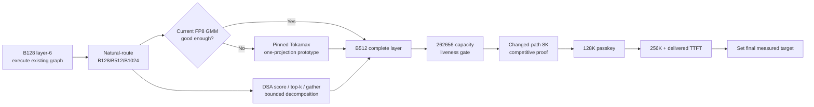

# Fast Single-Request GLM MoE Prefill on a Fixed 32-Chip TPU v4 Slice

## Executive answer

**Topic assumption.** The uploaded Astra 6 Pro research brief is treated as the operative topic and local source of truth: optimize the existing native-JAX `GLM-5.2-FP8` engine for **single-request, long-context prefill and time to first token on the existing 32-chip TPU v4 slice**, without changing the model, checkpoint, hardware allocation, decode semantics, or established numerical contracts. fileciteturn0file0

**Bottom line:** the engine is no longer fundamentally blocked by decoder correctness. It is blocked by **prefill granularity and data movement**. The historical serial teacher-forcing path turned a 127,363-token prompt into 16,425.515 seconds of device work; the genuine layer-major path fixes the execution model but its 2,034-token correctness configuration still takes 102.203 seconds, or about 19.9 input tokens/s. Meanwhile, the project's own real-weight MoE experiment already shows that processing the same 128 routed rows as one B128 group instead of eight B16 calls gives a **3.329× phase improvement** for distributed supplied routing. That is direct evidence that weight reuse and grouped execution, not another decoder-exactness campaign, are the immediate leverage points. [LOCAL] fileciteturn0file0

The public evidence does **not** substantiate a comparable result of roughly **10,000 input tokens/s for one long prompt on 32 TPU v4 chips**. The closest primary TPU-v4 result I found is Google's PaLM 540B work: it reaches **76% MFU while processing input tokens at large batch size** on TPU v4, but that is a dense model, 2K context, and a different batching regime. citeturn16academia24 An official current `tpu-inference` Qwen3.5-397B-A17B prefill case does explicitly test 8,192 input tokens, one output token, one sequence, prefix caching disabled, and max concurrency one—but it runs on **v7x-8**, and the benchmark file is a configuration, not a published throughput result. fileciteturn1file0L1-L6 Current `tpu-inference` quickstart documentation lists v7x, v6e and v5e, not v4, so the whole backend is not a drop-in answer for this slice. citeturn11search3

A likely source of “10K TPU tokens/s” comparisons is a different metric entirely. The official archived JetStream-PyTorch benchmark reports **10,873 tokens/s** for Llama 3 8B int8 on **v5e-8 with batch size 256**, max input 1,024 and max output 1,024. That is aggregate serving throughput for a tiny model relative to this 753B MoE, not one-prompt prefill. citeturn15search1 Similarly, vLLM's August 2026 “25K TPS/GPU” Qwen3.5 result uses GB200 NVL72, disaggregated prefill/decode, four to eight prefill endpoints, and concurrency 64–5,120; vLLM explicitly did not benchmark concurrency 1–32 for that headline result. citeturn17search0 These results are useful implementation leads but are **not valid baselines** for Astra's target.

Yet **10K is not ruled out by TPU-v4 peak compute alone**. Google specifies 275 BF16/int8 TFLOP/s and 1,200 GB/s HBM bandwidth per TPU v4 chip; 32 chips therefore provide a nominal 8.8 PFLOP/s and 38.4 TB/s aggregate HBM bandwidth. citeturn12search10 Using the project's useful-arithmetic model, 10K input tokens/s would require about **1.118 PFLOP/s, or 12.7% of fleet peak at 131,072 tokens**, and **1.232 PFLOP/s, or 14.0% at 262,144 tokens**. [DERIVED] fileciteturn0file0 That is not an absurd compute efficiency.

The stronger constraint is the project's own **expert-weight traffic estimate**. At B128, ideal routed expert traffic is about 5.57 GB per input token. At 10K tok/s that is **55.7 TB/s**, already **145% of the entire fleet's nominal HBM bandwidth**, before dense layers, scales, DSA, KV traffic, route buffers or imperfect reuse. Thus, under the assumptions behind that local estimate, **B128 is structurally incapable of 10K**, even with perfect compute. Its expert-weight-only roof is about 6.9K tok/s. At B512, the corresponding estimate is 1.42 GB/token, or 14.2 TB/s at 10K—about 37% of nominal fleet bandwidth—so the target becomes physically conceivable, although still aggressive. [DERIVED] fileciteturn0file0 citeturn12search10

This makes the immediate architectural decision unusually clear:

> **Run the already-acquired B128 layer-6 numerical/timing discriminator, but do not promote B128 as the final prefill architecture. Use it as the control point for a rapid move to a B512 MLP grouping window, with B1024 as the next performance point if B512 remains weight-traffic/MXU-underfill limited. Keep the current ≤32-row attention/indexer tiles initially.**

The B128 test is still worth running because its graphs and memory admission already exist, and not executing them would throw away high-value information. But the next design should decouple the granularities: **Q≤32 for causal DSA/attention and cache updates; B≈512–1024 for router/MoE work**. That matches the local evidence that larger routed groups help dramatically while respecting the existing M64 repair boundary. [LOCAL/HYPOTHESIS] fileciteturn0file0

For MoE, the preferred path is **adapt first, import selectively second**. Current `tpu-inference` uses Tokamax `gmm_v2`, combines gate/up in GMM1, fuses activation, executes GMM2, chunks work to overlap communication, and has a target slot chunk of 2,048 chosen empirically for MoE workloads. fileciteturn2file0L2-L2 Its mathematical layout, however, is materially different from Astra's. Its tensor-parallel GMM1 shards the output dimension, making local gate/up activation legal; Astra's gate/up contraction is split over feature4 and must be **FP32-reduced over feature4 before the BF16 boundary and SwiGLU**. [VERIFIED + LOCAL] fileciteturn2file0L2-L2 fileciteturn0file0 Therefore importing its fused GMM1+activation unchanged would be a correctness bug, not an optimization.

Tokamax itself is a valuable kernel source. Its pinned GMM implementation explicitly supports grouped RHS scales, fused gate/up representations, pipelined weight loads and FP32 preferred accumulation, and its current repository supports TPU `ragged_dot`; however, Tokamax warns that it is heavily under development and that autotuning can choose numerically different configurations, recommending serialization of fixed tuning results for reproducibility. fileciteturn6file0L1-L6 fileciteturn7file0L1-L2 citeturn18search0 A **single-projection, no-fused-activation Tokamax prototype on the existing v4/JAX installation** is consequently worthwhile, but only after the larger-group baseline establishes whether the current raw-FP8 kernel actually needs replacement.

The proposed end state is therefore not “B128, but faster.” It is a **hierarchical prefill engine**:

The confidence classification is therefore: **10K comparable public evidence: unsupported. 10K as a physical upper-performance objective: plausible only under explicit assumptions, especially B≥512 and much better DSA/MoE utilization. 10K as a near-term project promise: unjustified.**

The assumptions used throughout this report are: the uploaded brief correctly describes the current implementation; no local implementation or TPU traces beyond that brief were available to inspect; the existing checkpoint ownership and WS32 decode layout remain fixed; 10K means resident-weight, no-prefix-hit, one-request prompt tokens/s; and all numerical benefit ranges below are hypotheses until a local discriminator establishes them. fileciteturn0file0

## Scope and methodology

The research can be scoped three ways. The **medium scope is recommended** because it answers the project's next implementation decisions without reopening solved architecture questions or prematurely optimizing startup.

| Scope | Question answered | Included | Excluded | Decision value |
|---|---|---|---|---|
| **Narrow** | “Should the B128 layer-6 candidate be adopted?” | B128 execution, layer-6 trace, numerical replay, memory peak | Larger grouping, DSA redesign, external kernels | High immediate value, but risks optimizing a local maximum |
| **Medium — recommended** | “What is the fastest credible path from B128 to efficient 128K/256K single-request prefill?” | B128 discriminator; B512/B1024 grouping; current-vs-Tokamax GMM; tiled DSA; XProf; full-capacity liveness; own 8K proof | New hardware, new engine, full checkpoint repartition, speculative decoding | Best information/cost ratio |
| **Broad** | “What would the globally optimal GLM TPU inference stack look like without current implementation constraints?” | Alternative prefill partitioning, checkpoint ownership changes, pipeline/context parallelism, new serving platform | Nothing except hardware itself | Potential upside, but too much implementation churn before bottlenecks are measured |

The central research questions are therefore not whether batching helps—it demonstrably does—but **how large the MoE reuse window should be; whether the current raw-FP8 grouped kernel can exploit it; when DSA takes over the critical path; which communication is a mathematical dependency versus overlap opportunity; and whether full-capacity liveness permits those choices**. [LOCAL] fileciteturn0file0

The source policy was primary-first. Current hardware properties came from Google Cloud TPU documentation; compiler/kernel behavior from JAX/Pallas and OpenXLA/Tokamax; model architecture from DeepSeek's paper/repository where a DSA analogue was relevant; and benchmark semantics from the exact benchmark configuration or implementation whenever available. Maintainer/user issues were used only as **diagnostic evidence**, not as performance truth. For example, a MaxText issue reports MFU falling from 50.4% with 8 experts/top-2 to roughly 25–28% with 56 experts/top-14 despite holding active model size roughly constant; this is useful corroboration that many small expert groups can destroy grouped-GEMM utilization, but it is a user report on v5p, not evidence for Astra's v4 throughput. citeturn10search5

| Source type | What it can establish | What it cannot establish here | Priority |
|---|---|---|---|
| Official hardware/compiler documentation | v4 peak capabilities, Pallas semantics, profiling APIs | Achieved GLM throughput | Highest |
| Pinned production implementation | Exact fusion, layout, chunking, scale interfaces | Compatibility with Astra without checking layouts | Highest |
| Original research paper | Architecture, algorithm, experimental methodology | Usually not Astra's exact runtime or checkpoint | High |
| Official benchmark config/result | Workload definition and, when present, measured result | Cross-hardware comparability without normalization | High |
| Maintainer issue/discussion | Real failure modes, tuning leads | Headline performance claim | Secondary |
| Industry/news source | Release context and claim provenance | Kernel or numerical behavior | Context only |

A strict benchmarking taxonomy was applied: **single-prompt prefill**, aggregate multi-request throughput, output/decode throughput, prefix-cache-assisted throughput, kernel throughput, and training throughput are not interchangeable. This matters because MaxText's inference microbenchmark itself explicitly performs two warmups, times repeated compiled `engine_prefill` calls, then synchronizes the device; that measures a warm compiled prefill primitive, not delivered TTFT. fileciteturn4file0L1-L2

Likewise, JAX is asynchronous, so a timing or profile that does not eventually `block_until_ready()` can measure dispatch instead of execution; JAX's profiler documentation explicitly demonstrates synchronizing the device inside the captured region. citeturn13search1 This matches the local project's insistence on separating completed dispatch intervals, request wall time, load/compile and observer work. fileciteturn0file0

## Benchmark evidence

The table below is the closest apples-to-apples comparison obtainable from authoritative sources. Blank or “not published” fields are intentionally left unresolved rather than inferred.

| Evidence | Model | Hardware | Prompt / output | Concurrency / cache | Quantization | Result / timing boundary | Comparable to Astra? |
|---|---|---|---|---|---|---|---|
| **Astra DB574** [LOCAL] | GLM-5.2, 753B total / ~40B active | **32× TPU v4** | 127,363 prompt | 1 request; no prefix-hit premise | Existing FP8 checkpoint | 16,425.515 s serial prefill ≈ **7.75 input tok/s** | **Exact workload family, obsolete execution path** fileciteturn0file0 |
| **Astra DB588** [LOCAL] | Same | **32× TPU v4** | 2,034 prompt | 1 request | Same | 102.203 s layer-major prefill ≈ **19.9 tok/s**; 20/20 continuation tokens | **Closest current engine result, but B17/B11 and 2K** fileciteturn0file0 |
| **Astra DB589** [LOCAL] | Real GLM MoE phase | **32× TPU v4** | 128 supplied routed rows | Phase microbenchmark | Real FP8 expert weights | B16×8 → B128: **3.329× distributed**, 1.280× concentrated | Strong kernel/granularity evidence; **not full model** fileciteturn0file0 |
| **Google Pope et al.** | PaLM 540B dense | TPU v4 slices; exact comparison configuration varies | Context up to 2,048 | Large batch for input-processing headline | BF16 input processing; int8 used for low-batch decode result | **76% MFU processing input tokens**; 29 ms/token low-batch decode | Hardware-generation evidence, but dense/short/batched citeturn16academia24 |
| **JetStream-PyTorch official result** | Llama 3 8B | v5e-8 | max input/output 1,024/1,024 | **Batch 256** | int8 | **10,873 tok/s aggregate** | Likely origin class of “10K” claims; **not comparable** citeturn15search1 |
| **Pinned TPU-inference Qwen case** | Qwen3.5-397B-A17B-FP8 | **v7x-8** | **8,192 / 1** | **max seqs 1, concurrency 1, prefix cache disabled** | FP8 model and FP8 KV | Benchmark **configuration only; no result in file** | Methodologically close; wrong TPU generation and smaller active model fileciteturn1file0L1-L6 |
| **vLLM Qwen 25K headline** | Qwen3.5-397B-A17B-NVFP4 | GB200 NVL72 | 8,192 / 1,024 | **Concurrency 64–5,120**, 4–8 prefill endpoints + decode endpoint | NVFP4 | >25K total TPS/GPU Pareto headline | **Explicitly aggregate/disaggregated, not single prompt** citeturn17search0 |
| **DeepSeek FlashMLA sparse prefill** | DSA/MLA kernel | H800 SXM5 | Sparse attention microbenchmark | Kernel-level | BF16 compute; sparse decode also has FP8 KV | up to **640 TFLOPS sparse prefill** on H800 | Algorithm/kernel inspiration only; CUDA/Hopper, not tokens/s or TPU citeturn11search9turn11search7 |

The benchmark comparison produces three important findings.

First, **fast official implementations make the matrices large enough to deserve the accelerator**. The pinned `tpu-inference` fused-MoE path uses Tokamax grouped matmul, has an empirically chosen `TARGET_SLOT_CHUNK_SIZE = 2048`, can pipeline MoE chunks, and supports reduce-scatter-oriented output movement rather than treating each tiny routed group as a standalone dense GEMM. fileciteturn2file0L2-L2 The associated experimental fused-MoE implementation goes further, placing gather → GMM1 → activation → GMM2 → ICI A2A in one Pallas call. Its README also explicitly labels upstream-all-gather fusion and SparseCore random-access offload as **future work**, and says device-specific block sizes need retuning. fileciteturn3file0L1-L6

Second, **their fusion is layout-dependent**. `tpu-inference`'s tensor-parallel GMM weights are arranged so its first projection is split on its output feature dimension while its second is split on the contraction dimension; this permits local GMM1 activation. fileciteturn2file0L2-L2 Astra is the inverse in the critical first projection: gate/up have local `[32,2048,1536]` expert/output/input storage because the 6,144 hidden contraction is feature4-sharded, and the partial FP32 outputs must be reduced across feature4 before the BF16/SwiGLU boundary. [LOCAL] fileciteturn0file0 The attractive “just use fused MoE” option is therefore rejected unless the kernel exposes the required pre-activation collective or the checkpoint/layout is deliberately repartitioned.

Third, the useful upstream lesson from MegaBlocks is not “use this GPU kernel”; it is **represent sparse expert work directly instead of padding it into conventional dense batches**. The original MegaBlocks paper reformulates MoE around block-sparse operations, avoids token dropping, and reports substantial GPU-training improvements, but it is a GPU training system rather than a TPU inference result. citeturn18academia48 MaxText's TPU-oriented performance guide applies the same broad principle with grouped matmul for irregular MoE work and explicitly recommends profile → tune → repeat. citeturn10search7 Astra already has the right semantic abstraction—sorted grouped routes—but its present **group size is too small to amortize the expert table and schedule efficiently**.

The one-owner DB589 result is particularly informative. Perfect 8-row-tile occupancy did **not** make concentrated routing faster: concentrated B128 took 29.283 ms versus 12.028 ms for distributed routing. [LOCAL] fileciteturn0file0 The leading hypothesis is not “bad lane occupancy”; it is **owner critical-path imbalance**. Sending all 1,024 routed slots to one expert owner concentrates useful HBM loads and matrix work on one expert8 partition while other owners have less useful computation. That is exactly why route distribution and physical ownership need to be captured alongside tile occupancy. [HYPOTHESIS] The decisive evidence is a short multi-host XProf plus per-owner route counts, not another synthetic balanced-router test.

## Proposed prefill architecture

The recommended implementation separates **causal/cache granularity** from **weight-reuse granularity**.

For the first production candidate, set the outer MLP window to **B512**, comprising sixteen existing ≤32-row causal attention/indexer tiles. B1024 should be implemented as the next bucket only after B512 is timed; B2048 and B4096 should remain optional until memory, compile-size and DSA traces justify them. With 256 experts and top-8 routing, mean routed rows per expert are B/32: B128 gives 4, B512 gives 16, B1024 gives 32, and B2048 gives 64. [DERIVED from model topology] fileciteturn0file0 Given the current eight-row grouped quantum, B128 averages only half a tile per expert under a uniform-routing scenario, whereas B512 averages two full row quanta.

The logical B512 working sizes are modest compared with resident weights; the important issue is lifetime and replication, not the raw row tensor itself.

| Object at B512 | Logical shape / volume | Approximate size | Lifetime / ownership |
|---|---:|---:|---|
| Concatenated hidden rows | `[512, 6144]` BF16 | **6.0 MiB** logical | Residual remains production-sharded; do not full32 replicate |
| Router identities | `[512,8]` int32 | 16 KiB | One window |
| Router weights | `[512,8]` BF16–FP32 | 8–16 KiB | One window |
| Routed slots | 4,096 total | metadata only | Sorted by expert, then restored to route-slot order |
| Mean slots per expert owner | 512 across each of 8 expert owners | — | Highly variable under natural routing |
| Feature-shard routed input at uniform mean | `[512,1536]` BF16 | **1.5 MiB/chip** | Gate/up input reuse candidate |
| One local expert projection table | `[32,2048,1536]` U8 or `[32,1536,2048]` U8 | **96 MiB/chip** | Resident; dominant reason to reuse weights |
| Gate + up local raw bytes | two × 96 MiB | **192 MiB/chip** | Load tiles together/adjacently where useful |
| Gate or up FP32 partial, mean-owner case | `[512,2048]` FP32 | **4 MiB/chip** | Must survive until feature4 reduction |
| Post-reduction gate/up BF16 interface | `[512,2048]` each | **2 MiB each** | Numerical boundary before SwiGLU |
| SwiGLU output | `[512,2048]` BF16 | **2 MiB** | Down-projection input |
| Down local output, mean-owner case | `[512,1536]` BF16 | **1.5 MiB/chip** | Slot restore/weighted combine next |

These are logical/mean-routing sizes derived from the checkpoint interface, not a substitute for optimized-HLO physical liveness. The local layer-6 selected weights alone are 326,079,840 B/chip, and DB590 already showed B128 temporary allocation of 203,686,912 B versus 96,066,560 B for the B32 control. [LOCAL] fileciteturn0file0 That is why the full B512 admission must use actual executable liveness and a fixed reserve rather than adding logical tensor sizes on paper.

**MoE execution should be:**

`route B512 → sort route slots → execute gate/up grouped projections → feature4 FP32 reduction → existing BF16 completion boundary → SwiGLU → grouped down → restore route-slot order → BF16 route weighting → FP32 per-token route accumulation → expert8 FP32 combine → BF16 residual interface.`

The first kernel optimization should attempt to **reuse the same activation tile across separate gate and up weight streams and arrange their U8 weight + block-scale loads adjacently**, while retaining the mandatory reduction before activation. Tokamax shows a useful implementation device: its fused-weight representation interleaves gate/up at lane granularity, and its grouped kernel pipelines RHS tiles and carries scale metadata with each grouped RHS. fileciteturn6file0L1-L6 fileciteturn7file0L1-L2 Astra can borrow the loading/scheduling idea without borrowing the invalid activation placement.

A direct Tokamax adapter also needs a scale-layout bridge. The pinned `gmm_v2` API describes RHS scales as `[group, num_blocks, 1, out_size]`, whereas Astra stores per-128×128 scales as compact two-dimensional block grids such as `[32,16,12]` for gate/up. fileciteturn5file0L1-L16 fileciteturn0file0 The right experiment is an **ephemeral in-kernel/block-view adaptation**—transpose/index the compact K/N block coordinates and broadcast a scale across its 128 output lanes—not a new expanded-scale checkpoint. [HYPOTHESIS] Persistent expansion would waste memory/storage for a representation the current checkpoint already encodes.

For DSA, the final architecture should not make a score tensor proportional to `prompt_rows × index_heads × full_context`. DeepSeek's own V3.2 work confirms the architecture pattern: a lightweight indexer selects a sparse subset for core attention, reducing the expensive attention path while the indexer still scans history. citeturn11search0turn10search0 DeepSeek's released FlashMLA includes token-level sparse prefill kernels, but those are Hopper/B200 CUDA kernels, so their implementation is not portable to v4; the reusable principle is tiled scoring and sparse attention, not CUDA-specific machinery. citeturn11search9

The proposed exact DSA loop is:

1. Keep the existing query tile at `Q ≤ 32`.
2. Sweep historical index keys in a first candidate key tile of **256 or 512 positions**; both align naturally with the indexer's 128-wide feature dimension and should be microbenchmarked rather than assumed optimal. Pallas' TPU programming model is explicitly tiled and designed to stage HBM blocks into on-chip memory. citeturn12search9
3. Set the device loop bound from the maximum absolute query position in the Q tile, so a future-only key block is **never loaded or scored**. Only the causal diagonal/partial block needs per-row masking.
4. Compute a bounded score slab. For example, `Q32 × 8 index heads × K512 × FP32` is 0.5 MiB; stream head groups rather than constructing all 32 heads over full context. The exact existing head-combination arithmetic must remain unchanged. [DERIVED/HYPOTHESIS] fileciteturn0file0
5. Once the executing scorer has produced its scalar ordering key for each position, take a block-local exact candidate set and merge it into the running top-2048 using the engine's required lexicographic key: **score descending, absolute position ascending on ties**. Do not change the tie contract.
6. A running top-2048 represented by FP32 score + int32 position for 32 query rows is only about **0.5 MiB**. [DERIVED]
7. Gather the resulting selected latent/KV positions by the existing page mapping and perform sparse attention with stable running-max/running-sum softmax, so selected attention can be streamed rather than materializing another large selected-KV tensor.
8. Maintain the existing cache visibility contract: prefill attention reads **unrepaired** index keys throughout; repair writes to separate storage; repaired state is published only after the prompt completes. [LOCAL] fileciteturn0file0

The selected-KV streaming stage should borrow the same mathematical principle as memory-efficient tiled attention—load manageable K/V blocks and maintain online softmax statistics—rather than copying FlashMLA implementation details. MaxText's Pallas performance guidance similarly describes attention kernels as blocking Q/K/V and using online softmax to avoid materializing full attention matrices. citeturn10search7

Communication remains on the existing `expert8 × feature4` topology initially. The feature4 gate/up reduction is a **true mathematical dependency** before nonlinear activation and cannot be deferred past SwiGLU. The expert8 combine after route accumulation is also part of the admitted output semantics. [LOCAL] fileciteturn0file0 What can be optimized is scheduling: weight DMA for another expert tile can overlap independent arithmetic/communication, and small metadata collectives may be packed. The pinned TPU-inference implementation, for example, packs top-k indices and weights into one blob before all-gather because they are individually small. fileciteturn2file0L2-L2

For more aggressive communication overlap, Pallas provides asynchronous remote copies, and JAX's distributed-Pallas documentation describes `make_async_remote_copy` and semaphore-based device communication; its examples explicitly cover TPU distributed kernels. citeturn12search9 This is a valid later v4-compatible mechanism, but it should only be introduced after XProf shows communication on the critical path. The experimental fused-MoE implementation's communication fusion is attractive, but its own README says tuning is device-specific. fileciteturn3file0L1-L6

## Roofline and targets

The useful arithmetic model supplied with the project gives the following lower-level compute picture. [LOCAL] fileciteturn0file0

| Prompt | Useful arithmetic | Time at 10K tok/s | Required useful fleet rate | Fraction of 8.8 PFLOP/s nominal peak |
|---:|---:|---:|---:|---:|
| 127,363 | 14.198 PFLOP | 12.736 s | 1.115 PFLOP/s | 12.7% |
| 131,072 | 14.654 PFLOP | 13.107 s | **1.118 PFLOP/s** | **12.7%** |
| 262,144 | 32.287 PFLOP | 26.214 s | **1.232 PFLOP/s** | **14.0%** |

The denominator is Google's 275 BF16/int8 TFLOP/s per v4 chip times 32 chips. citeturn12search10 The local FLOP model omits routing, norms, activation, top-k/sorting, repair, padding, communication and several path-specific operations, so those percentages are **necessary useful-compute efficiency**, not sufficient system efficiency. fileciteturn0file0

For reference, at 131K, pure useful-arithmetic performance would correspond to approximately:

| Effective useful arithmetic efficiency | Arithmetic-only time | Arithmetic-only input rate |
|---:|---:|---:|
| 4% peak | 41.6 s | 3.15K tok/s |
| 6% peak | 27.8 s | 4.72K tok/s |
| 8% peak | 20.8 s | 6.30K tok/s |
| 10% peak | 16.7 s | 7.87K tok/s |
| 12% peak | 13.9 s | 9.45K tok/s |
| 14% peak | 11.9 s | 11.0K tok/s |

[DERIVED] These rows deliberately exclude all non-modelled overhead. Google's dense PaLM experiment demonstrates that far higher MFU is possible for large batched input matrices on v4, but its 76% figure cannot be transferred to this MoE/DSA workload. citeturn16academia24

The more useful MoE roofline comes from HBM:

| MoE grouping | Local ideal routed-weight estimate | Expert-weight traffic at 10K | Fraction of nominal 38.4 TB/s fleet HBM | Weight-only theoretical ceiling |
|---:|---:|---:|---:|---:|
| **B128** | 5.57 GB/token | **55.7 TB/s** | **145%** | **~6.9K tok/s** |
| **B512** | 1.42 GB/token | **14.2 TB/s** | **37%** | **~27K tok/s** |

[DERIVED from LOCAL traffic estimates + VERIFIED hardware.] fileciteturn0file0 citeturn12search10 Real sustainable bandwidth is below peak, and dense weights, scales, index keys, caches and communication consume part of the same machine, so neither ceiling should be read as achieved throughput.

This calculation is the strongest reason to stop treating B128 as the destination. At B128, **even the optimistic local weight-reuse model breaks the 10K target before any other phase executes**. B512 does not guarantee 10K, but it removes that first impossibility.

The corresponding target bands should be treated as **engineering envelopes**, not commitments:

| Envelope | Necessary conditions | Resident no-prefix-hit prefill rate worth planning around |
|---|---|---:|
| **Pessimistic** | B512 works but DSA/top-k or ICI remains inefficient; useful compute ~4–6% | roughly **3–5K tok/s** |
| **Credible stretch** | B512/B1024, healthy owner balance, tuned grouped GMM, bounded DSA; useful compute ~6–10% plus manageable non-FLOP work | roughly **5–8K tok/s** |
| **Optimistic** | B≥512, successful GMM/HBM overlap, exact DSA selection/gather no longer critical, useful arithmetic ~11–15% and non-FLOP overhead controlled | roughly **8.5–12K tok/s** |

[HYPOTHESIS/DERIVED.] The ranges are deliberately not forecast from the present 19.9 tok/s result; that result contains gross granularity/engine overhead and is far from a hardware roofline. fileciteturn0file0

DSA's importance increases with context. The local arithmetic model has causal DSA at 1.478 PFLOP around 131K and 5.911 PFLOP at 256K, while selected attention grows approximately linearly from 2.893 to 5.809 PFLOP. [LOCAL] fileciteturn0file0 Thus DSA rises from roughly **10% of modelled useful arithmetic at 131K to 18% at 256K**. [DERIVED] More importantly, exact top-k selection and index-key scanning may become memory/vector/sort bound before arithmetic itself does. A roofline that models DSA only as FLOPs is therefore incomplete.

Three benchmark definitions should be registered and never merged:

| Metric | Start | Stop | Includes |
|---|---|---|---|
| **Resident prefill** | first prompt-processing device dispatch after resident weights/caches are ready | final prompt state/cache ready | Actual prompt processing; no prefix hit; one request |
| **Warm delivered TTFT** | accepted warm request | first generated token delivered across serving boundary | transfer/preparation, cache initialization/update, prefill, first decode, delivery |
| **Cold startup** | process/runtime/model startup | engine ready for warm request | model load, compilation/cache lookup, initialization |

The project's DB574 load/compile numbers should therefore remain separate from its 16,425-second device prefill. [LOCAL] fileciteturn0file0 MaxText similarly separates its prefill microbenchmark from autoregressive timing. fileciteturn4file0L1-L2

## Experiment sequence and verification

The following recommendations are ranked by expected **information gain per TPU-minute**, not by conceptual novelty.

| Priority | Evidence / hypothesis | Exact change | Compatibility | Expected phase benefit | Main risk | Smallest decisive test | Decision |
|---|---|---|---|---|---|---|---|
| **Immediate** | DB590 graphs exist but were never executed | Execute current B128 layer-6 candidate and B32 control exactly as acquired | Highest; current engine | Not a claimed optimization; closes uncertainty | Numerical mismatch or live scratch > admission | Real layer6 replay, bounded rows, synchronized timing, peak memory | **ADOPT as discriminator, not architecture** |
| **Next** | DB589 gives 3.329× B16→B128; B128 HBM roof is inadequate | Aggregate **B512**, then B1024 if justified, while keeping Q≤32 attention tiles | High | **~1.5–3× MoE-phase throughput** over B128 is a test hypothesis, not full-model estimate | code size, owner skew, scratch | Same real layer, same natural routes, B128/B512/B1024 | **ADOPT B512 experiment** |
| **Conditional** | Tokamax has mature TPU grouped primitives and pipelined RHS scheduling | One gate/up projection via pinned `gmm_v2`, **no fused activation**, compact-scale adapter | Medium; must compile on existing v4/JAX | **0–1.5×** versus tuned current kernel; adopt only if ≥1.25× and exact | API/version mismatch, scale layout, numerics | One projection, real FP8 weights, exact completed BF16/FP32 interface | **PROTOTYPE, do not migrate engine** |
| **High** | DSA is quadratic and may take over at long prefix | Q32 × K256/512 score slabs + exact running top-2048 | High; semantic-preserving | Memory asymptotic improvement mandatory; latency benefit unknown | top-k dominates, cache semantics | score-only/top-k-only/gather microbench at 8K/32K/128K prefix | **ADOPT design if exact and bounded** |
| **Later** | Communication fusion works upstream but layout differs | Pack tiny metadata; overlap legal DMA; possibly fused collective/GMM | Medium | **0–15% phase** unless trace proves larger stall | ordering/collective deadlock | Short layer trace with/without one fusion | **DEFER until trace proves critical path** |

The five first experiments should be:

| Experiment | Inputs and reference | Instrumentation | Execution budget | Memory / stop rule | Success condition |
|---|---|---|---|---|---|
| **B128 layer-6 discriminator** | Current DB590 B128 and B32 graphs; identical real layer-6 state/reference | Phase timestamps, exact routes/state/cache, synchronized per-call timing, peak live memory | One selected real layer; warm then tens of samples, not a full model | Preserve fixed 1 GiB reserve; allocator limit minus reserve is about **31.94 GB/chip** [DERIVED] | Numerical admission plus a clear phase/timing delta; otherwise localize before any larger window |
| **Natural-route grouping sweep** | Same captured real layer state/routes; B128, B512, B1024 | rows/expert, active experts, `ceil(rows/8)` tiles, padding, per-owner routes, max/mean owner load, grouped-kernel time | MoE phase only | Stop a bucket before full layer if compilation/liveness exceeds reserve | Identify throughput knee and whether owner skew or tile underfill dominates |
| **Tokamax compatibility probe** | One real projection, current raw U8 + scales, current activation BF16 | exact completed projection output; HLO/kernel identity; wall time | One projection | **No environment upgrade/install campaign**; stop if isolated pin cannot run | ≥1.25× projection/GMM phase at identical interface or a decisive rejection |
| **DSA decomposition** | Q32 at prefix 8K, 32K, 128K; same executing scorer | score-only, exact top-k on precomputed scores, selected gather separately | Bounded single-layer primitive | No full-context score tensor | Identify score vs selection vs gather bottleneck and K256/512 crossover |
| **B512 complete layer-6 + capacity-shape variant** | 16 attention/index tiles → B512 MLP; separate 262,656-capacity cache allocation with final-prefix addresses | XProf, memory viewer, semantic observers | One selected layer, not 78 layers | Stop on reserve breach, executable blow-up, wrong untouched-cache bytes | Numerical pass, lower per-row layer time than B128, capacity shape fits |

Only after these pass should the changed path pay for its own **competitive 8K full-model proof**; after that, one 128K proof should precede 256K. Re-running the forbidden serial 128K path adds no useful information. [LOCAL] fileciteturn0file0

The natural routing record can stay tiny. For each MoE layer/window, save the 256-element rows-per-expert histogram; active-expert count; eight-row tile count; padding rows; maximum expert occupancy; eight expert-owner route totals; `max_owner / mean_owner`; and, when the kernel exposes it cheaply, number of repeated expert-weight tile loads. Those statistics distinguish three otherwise-confounded cases: **small groups**, **poor row padding**, and **physical owner imbalance**. Replacing the router with random routing is inappropriate for this measurement; the upstream TPU-inference code itself describes forced random routing as performance-debugging behavior. fileciteturn2file0L2-L2

The minimal XProf capture should cover repeated complete layer-6 executions after warmup, with `jax.profiler.TraceAnnotation` labels around DSA score, exact top-k merge, selected gather/attention, routing/sort, gate/up GMM, feature4 reduction, activation, down GMM, route/expert combine and cache writes. JAX documents `TraceAnnotation`, trace contexts and multi-device TPU capture; XProf provides per-device timelines, op-level statistics and memory tooling. citeturn13search9turn13search6 Google also exposes the TPU Cloud Monitoring metric `tpu/tensorcore/idle_duration`, which is useful as a coarse indication of underutilization or stragglers. citeturn13search3

Do **not** invent a “MXU occupancy counter” that may not exist in this libtpu/XProf pin. The robust interpretation is: correlate the optimized HLO/dot/GMM identity, its duration, the per-device timeline, TensorCore idle duration where available, route metadata and a controlled kernel throughput baseline. A long critical device plus idle peer owners in the concentrated-route case supports the owner-skew hypothesis; comparable device occupancy but long GMM intervals points toward HBM/tile scheduling; gaps between kernels point toward dispatch or synchronization. [HYPOTHESIS supported by available profiling interfaces.] citeturn13search0turn13search6

Correctness should remain targeted rather than ceremonial:

| Failure | First inexpensive check | Evidence to save before failure handling | Escalate only when |
|---|---|---|---|
| Wrong routes | First failing router row: own scores + ordered top-8 + tie keys | Raw route scores/indices/weights and grouped permutation | Same completed router input produces different exact route order |
| Wrong DSA set | First failing query: score block and every running top-k merge around divergence | positions, scores, tie ordering, causal bounds | Own-score exact top-2048 merge is wrong |
| Tensor-only drift | Replay from last **completed BF16 interface** and FP32 route-sum boundary | original input/output tensors, graph fingerprint | Drift survives completed-interface replay |
| OOM | XProf Memory Viewer + point-in-time device-memory profile | live buffer names/sizes and executable identity | Required resident state + fixed reserve cannot coexist |
| Hang | Last matched fleet vote, last collective/annotation, host heartbeat | all host logs before recovery | Hosts disagree on collective progression |
| Wall regression | Compare critical-path trace rather than summed phase labels | same routes, same graph/source pin, device timeline | Correct candidate remains slower after warm steady-state |

JAX recommends XProf's Memory Viewer for device-memory analysis and additionally supports snapshots of every live device buffer attributed to Python allocation stacks; that is directly useful for distinguishing an optimized-HLO alias from a Python reference accidentally keeping an old cache alive. citeturn13search2turn13search6

Persistent compilation caching is worth enabling **after**, not before, graph variants settle. JAX's cache key already includes non-optimized HLO, jaxlib version, relevant XLA flags and device configuration/topology, and it exposes a custom hook for additional provenance. citeturn12search0 Astra should add its source commit, static window/tail configuration, topology identifier, libtpu/JAX pin, relevant environment flags and checkpoint-pack digest to an adjacent manifest or custom key. Because the local project has storage restrictions and limited controller disk, cache retention should be explicitly bounded rather than following generic cloud-storage lifecycle recommendations that conflict with the project's fixed bucket policy. [LOCAL] fileciteturn0file0

## Gaps, contradictions, and rejected paths

The largest evidence gap is still **representative phase attribution**. The current 19.9 tok/s full-model result proves the new semantics, but without a prefill XPlane/XProf trace it does not tell us whether 75 MoE layers, DSA, sparse attention, launch structure or collectives dominate. [LOCAL] fileciteturn0file0 This is why extrapolating DB589's 3.329× MoE result into a full-model speedup would be unjustified.

The second gap is **natural routing occupancy**. DB589 deliberately used supplied routes, and its concentrated/distributed comparison demonstrates that the router's physical owner distribution matters at least as much as lane fill. [LOCAL] fileciteturn0file0 Until real layer routes supply rows/expert and expert-owner imbalance, any B512/B1024 recommendation remains a strong but unmeasured hypothesis.

The third is **runtime memory at long capacity**. DB590 compile allocations establish that the B128 executable exists; they do not establish the peak live set once full caches, candidate/rollback state and selected-layer work are simultaneously alive. DB572's 262,656-capacity 8K run had only about 3.36 GB allocator headroom, while B128 already roughly doubles the selected layer's temporary executable allocation relative to the B32 graph. [LOCAL] fileciteturn0file0 The proposed full-capacity shape/selected-layer test is therefore a true gate.

There is also a useful upstream contradiction: TPU-inference is one of the most relevant sources of modern TPU MoE implementation ideas, yet its current public quickstart does **not** include TPU v4 among supported generations. citeturn11search3 At the same time, JAX/Pallas distributed programming facilities are TPU-generic enough to expose remote-DMA primitives, and Google's existing v4 documentation remains current. citeturn12search9turn12search10 The correct conclusion is not “modern TPU kernels cannot work on v4”; it is **kernel-by-kernel compilation and correctness must be demonstrated on the frozen v4 software pin**.

The same caution applies to SparseCore. Current Google performance guidance for newer Ironwood explicitly recommends certain SparseCore/collective overlap techniques, but that advice is written for the newer dual-chiplet architecture, not v4. citeturn12search1 The experimental TPU-inference MoE README also lists SparseCore offload of routed random-access work as future work rather than a completed performance result. fileciteturn3file0L1-L6 Therefore SparseCore offload is a **research lead, not a first implementation step**.

The following attractive paths should be rejected or deferred:

| Attractive idea | Decision | Reason |
|---|---|---|
| **Keep B128 as the final architecture because it already compiles** | **Reject** | Local ideal expert-weight traffic alone exceeds fleet HBM peak at 10K; B128 is a discriminator, not a credible final reuse window. fileciteturn0file0 citeturn12search10 |
| **Import TPU-inference's fused GMM1 + activation unchanged** | **Reject** | Its sharding makes activation local; Astra requires feature4 reduction before nonlinear activation. fileciteturn2file0L2-L2 fileciteturn0file0 |
| **Repack the checkpoint into a new gate/up layout now** | **Reject** | High storage/memory/change risk before proving current layout is the limiting factor; conflicts with existing retained pack/storage constraints. fileciteturn0file0 |
| **Expand the whole expert table to BF16** | **Reject** | Explicitly forbidden locally and would destroy the memory advantage of the FP8 checkpoint. fileciteturn0file0 |
| **Adopt Tokamax wholesale / upgrade JAX or libtpu to make it work** | **Reject** | Frozen environment; Tokamax itself warns of active API development. Test an isolated pinned primitive only. citeturn18search0 |
| **Use autotuning without pinning the chosen configuration** | **Reject** | Tokamax warns timing noise can choose different configurations with different numerics; serialize the selected tuning result. citeturn18search0 |
| **Randomly balance routes as the performance benchmark** | **Reject** | It removes exactly the natural owner-imbalance signal that needs measurement; upstream also labels forced random routing as performance-debugging behavior. fileciteturn2file0L2-L2 |
| **Materialize full-context DSA scores and mask the future afterward** | **Reject** | Preserves quadratic scratch/traffic and violates the stated requirement to skip future-only work physically. fileciteturn0file0 |
| **Use approximate/GPU-specific heuristic top-k** | **Reject for now** | Exact own-score/tie semantics are binding; NVIDIA's GVR path, for example, is explicitly Blackwell-specific and is not a TPU-v4 mechanism. citeturn10search8 |
| **Reopen PP8/PP16 or whole checkpoint partitioning immediately** | **Defer** | Current WS32 decode is already correct; change partition only if B512/B1024 traces expose an irreducible layout bottleneck large enough to justify transition cost. fileciteturn0file0 |
| **Prioritize cold loading** | **Defer** | Local DB574 shows prompt processing dwarfed load/compile; startup is not the dominant blocker. fileciteturn0file0 |
| **Use speculative decode, continuous batching or prefix cache to claim prefill success** | **Reject as solution** | They do not improve the required one-request, no-prefix-hit prompt computation and would change the benchmark definition. |
| **Repeat 128K serial teacher forcing for comparison** | **Reject** | Already demonstrated to consume ~4.56 hours and provides no new architectural information. fileciteturn0file0 |

The most important open questions, in order, are therefore: **what fraction of B128 layer-6 wall is MoE versus DSA/attention/collectives; what natural route distribution does GLM produce; where the B512/B1024 grouped-kernel knee lies; whether exact top-k rather than scorer arithmetic dominates at 128K; and what the full-capacity live-memory peak is for the changed graph.** Everything else can wait.

## Annotated bibliography and milestones

The following bibliography emphasizes sources published or materially current within the last ten years and separates directly reusable implementation evidence from contextual material.

| Source | Type and annotation |
|---|---|
| **Google Cloud, [TPU v4 specification](https://docs.cloud.google.com/tpu/docs/v4)** | **Official hardware documentation.** Establishes 275 BF16/int8 TFLOP/s, 32 GiB HBM and 1,200 GB/s bandwidth per v4 chip and 3D mesh topology. It is the denominator for the report's compute/HBM rooflines, not an achieved model result. citeturn12search10 |
| **Pope et al., [Efficiently Scaling Transformer Inference](https://arxiv.org/abs/2211.05102), 2022** | **Original Google paper.** Best primary v4 inference comparison found: analytical partitioning and low-level optimization for 500B+ dense transformers; PaLM 540B reaches 76% MFU for large-batch input processing. Useful proof of v4 capability, but not MoE or long single-request DSA. citeturn16academia24 |
| **vLLM Project, [TPU-inference](https://github.com/vllm-project/tpu-inference), 2026** | **Official implementation.** Current open-source TPU serving stack and source of the most relevant modern TPU MoE code. Current quickstart supports v7x/v6e/v5e rather than v4, so isolated algorithms are more relevant than engine migration. citeturn11search2turn11search3 |
| **TPU-inference pinned [Qwen3.5-397B prefill benchmark configuration](https://github.com/vllm-project/tpu-inference/blob/871abba1d70db1c9c7474bd80bd199546bf78365/.buildkite/benchmark/cases/daily/Qwen3.5_397B_prefill.json), 2026** | **Pinned official benchmark configuration.** Particularly valuable because GBS1 is genuinely one-sequence, max-concurrency-one, 8K/1 and prefix-cache-disabled. It is v7x-8 and provides no measured result itself. fileciteturn1file0L1-L6 |
| **TPU-inference pinned [`fused_moe_gmm.py`](https://github.com/vllm-project/tpu-inference/blob/871abba1d70db1c9c7474bd80bd199546bf78365/tpu_inference/layers/common/fused_moe_gmm.py), 2026** | **Pinned official code.** Uses Tokamax GMM, fused gate/up activation, pipelined chunks, packed small routing metadata and a 2,048-slot target chunk. Also exposes why its sharding permits a fusion Astra cannot copy directly. Apache-2.0 header in source. fileciteturn2file0L2-L2 |
| **TPU-inference pinned [experimental fused MoE README](https://github.com/vllm-project/tpu-inference/blob/871abba1d70db1c9c7474bd80bd199546bf78365/tpu_inference/kernels/experimental/fused_moe/README.md), 2026** | **Official implementation documentation.** Describes single-Pallas gather→GMM1→activation→GMM2→A2A fusion and an AG+GMM example. Crucially separates implemented work from future upstream-AG/SparseCore ideas and warns block sizes must be retuned per device. fileciteturn3file0L1-L6 |
| **OpenXLA, [Tokamax](https://github.com/openxla/tokamax), 2026** | **Primary kernel library.** TPU/GPU custom kernels and TPU `ragged_dot`; autotuning and serialization infrastructure. Its “heavily under development” status and numerical-autotuning caveat make a fixed-pin isolated evaluation preferable to wholesale adoption. citeturn18search0 |
| **Tokamax pinned [`gmm_v2.py`](https://github.com/openxla/tokamax/blob/c4d7d68a92a40fbc4b70e5ca42242bba709b014e/tokamax/_src/ops/experimental/gmm_v2/gmm_v2.py), 2026** | **Pinned kernel source.** Shows fused gate/up lane interleaving, quantization/scale references, FP32 preferred accumulation and pipelined RHS block movement. Best concrete source for adapting Astra's raw-FP8 schedule while preserving its own reduction boundary. fileciteturn6file0L1-L6 fileciteturn7file0L1-L2 |
| **AI Hypercomputer MaxText pinned [`inference_microbenchmark.py`](https://github.com/AI-Hypercomputer/maxtext/blob/c55443590e2925b5da66f82ea7bc9a32a8c662e3/src/maxtext/inference/inference_microbenchmark.py), 2026** | **Official benchmark implementation.** Useful mainly for timing methodology: static prefill executables, warmups, repeated calls and final synchronization. Shows why primitive prefill timing must not be mislabeled delivered TTFT. fileciteturn4file0L1-L2 |
| **MaxText, [Pallas kernel performance guide](https://github.com/AI-Hypercomputer/maxtext/blob/main/docs/guides/optimization/pallas_kernels_performance.md), current** | **Official implementation guide.** Covers grouped matmul for irregular MoE and tiled/online-softmax attention; directly supports profile-and-tune methodology, while not providing Astra-equivalent inference numbers. citeturn10search7 |
| **JAX, [Distributed Computing in Pallas for TPUs](https://docs.jax.dev/en/latest/pallas/tpu/distributed.html), current** | **Official compiler documentation.** Documents remote DMA and semaphore primitives needed for genuine communication/compute overlap without host-staged transport. Appropriate only after traces prove communication critical. citeturn12search9 |
| **JAX, [Profiling computation](https://docs.jax.dev/en/latest/profiling.html), current** | **Official profiling documentation.** Establishes XProf/Perfetto capture, explicit device synchronization and memory/graph analysis. Foundation for the proposed small prefill trace rather than decode-trace inference. citeturn13search1turn13search6 |
| **JAX, [Persistent compilation cache](https://docs.jax.dev/en/latest/persistent_compilation_cache.html), current** | **Official runtime documentation.** Documents cache-key inputs, multi-node behavior and custom provenance hook. Useful to cut repeated compilation cost after the graph variants stabilize. citeturn12search0 |
| **DeepSeek-AI, [DeepSeek-V3.2 technical report](https://arxiv.org/abs/2512.02556), 2025** | **Original model paper.** Primary reference for DSA: learned sparse selection reduces the expensive attention path in long context. It validates the architectural family, not Astra's exact index-cache arithmetic. citeturn11search0 |
| **DeepSeek-AI, [FlashMLA](https://github.com/deepseek-ai/FlashMLA), 2025–26** | **Official kernel repository.** Includes token-level sparse prefill and reports up to 640 TFLOPS on H800. Valuable for sparse-attention scheduling concepts; implementation and performance are CUDA/Hopper/B200-specific and must not be transferred numerically to TPU v4. citeturn11search9turn11search7 |
| **Gale et al., [MegaBlocks](https://arxiv.org/abs/2211.15841), 2022** | **Original systems paper.** Establishes the value of representing irregular expert work with block-sparse/grouped operations and avoiding token dropping/padding waste. GPU training results are intentionally not used as a TPU-inference speed estimate. citeturn18academia48 |
| **AI Hypercomputer, [JetStream-PyTorch benchmark summary](https://github.com/AI-Hypercomputer/jetstream-pytorch/blob/main/benchmarks/summary.md), 2024** | **Official historical benchmark.** Particularly useful for debunking metric conflation: the 10,873 tok/s Llama-3 result is v5e-8, int8, batch 256—not single-prompt long-context prefill. citeturn15search1 |
| **vLLM Team, [Qwen3.5 25K TPS/GPU report](https://vllm.ai/blog/2026-08-06-qwen35-25k-tps), 2026** | **Primary industry/project report.** Excellent example of modern scheduling, kernel fusion and endpoint specialization, but the headline is an aggregate high-concurrency GB200 result. Its 8×B200 prefill-only kernel integration also reports a much more modest 1.13× end-to-end prefill improvement, illustrating the gap between kernel wins and whole-engine wins. citeturn17search0 |

The work should proceed as a **dependency timeline**, not a calendar ETA:

| Milestone | Maximum necessary scope | Advance condition |
|---|---|---|
| **Current frontier** | B128 layer-6 execution only | Numerical pass + synchronized timing + runtime peak |
| **Grouping decision** | Real layer MoE B128/B512/B1024 | Clear throughput knee, route/owner statistics captured |
| **Kernel decision** | Existing raw-FP8 vs isolated Tokamax projection | Replacement wins materially **and** preserves completed numerical interface |
| **DSA decision** | Q32 bounded scorer/top-k/gather microbench | Exactness plus bounded scratch; know which subphase dominates |
| **Layer-window admission** | Complete B512 layer6 + full-capacity shape/liveness | Faster than B128 per real row; fixed reserve retained |
| **Competitive correctness** | Changed path's own 8K full model | Correct raw continuation, competitive DSA adjudication, memory/trace sealed |
| **Long proof** | One 128K passkey before 256K | Correct quality/state/cache and acceptable prefill/TTFT trajectory |
| **Final target setting** | 128K/256K resident prefill + warm TTFT | Empirical efficiency bands replace speculative 10K target |

This sequence also avoids unnecessary artifact growth: keep route histograms, timing summaries, graph/source fingerprints, failing bounded arrays, compact XProf captures and irreplaceable quality receipts; do not accumulate full tensor dumps, duplicate HLOs or another checkpoint pack. [LOCAL] fileciteturn0file0

**The implementer's next three concrete actions are:**

| Action | Exact deliverable | Stop / promotion rule |
|---|---|---|
| **Execute DB590's B128 layer-6 discriminator now** | B32 vs B128 numerical verdict, p50/p99 completed-device timing, runtime peak, same-route phase breakdown | Do not alter architecture until any numerical failure is localized; if correct, B128 becomes control only |
| **Add natural-route telemetry and build the B512 MoE window** | 256-expert histogram + owner skew + active/padded tile counts; same-input B128/B512 and, if useful, B1024 phase results | Promote B512 only if per-real-row MoE time materially falls and fixed memory reserve survives |
| **In parallel with B512 integration, run the Q32 DSA decomposition** | 8K/32K/128K score-only, exact-top-k-only and gather timings with K256/K512 plus exact-selection replay | Optimize the measured dominant subphase; do not design a large DSA rewrite from intuition |

The project should therefore **continue the B128 step exactly once, immediately turn it into the control for B512, and let real routing plus a real prefill trace—not headline token/s figures from unrelated systems—decide what comes next.**